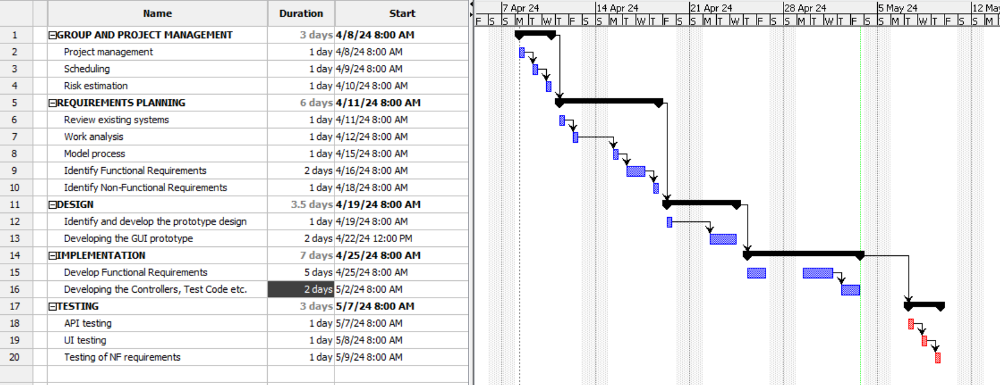

# Project Estimation - CURRENT
Date: 2024-05-04

Version: 1.0

# Estimation approach
Consider the EZElectronics  project in CURRENT version (as given by the teachers), assume that you are going to develop the project INDEPENDENT of the deadlines of the course, and from scratch
# Estimate by size
### 
|             | Estimate                        |             
| ----------- | ------------------------------- |  
| NC =  Estimated number of classes to be developed   |              10               |             
|  A = Estimated average size per class, in LOC       |          100                  | 
| S = Estimated size of project, in LOC (= NC * A) | 1000 |
| E = Estimated effort, in person hours (here use productivity 10 LOC per person hour)  |             100                         |   
| C = Estimated cost, in euro (here use 1 person hour cost = 30 euro) | 3000 | 
| Estimated calendar time, in calendar weeks (Assume team of 4 people, 8 hours per day, 5 days per week ) |      1              |               

# Estimate by product decomposition
### 
|         component name    | Estimated effort (person hours)   |             
| ----------- | ------------------------------- | 
|requirement document    | 10 |
| GUI prototype |5|
|design document |5|
|code |100 |
| unit tests |5|
| api tests |5|
| management documents  |5|

# Estimate by activity decomposition
### 
| Activity Name                       | Estimated Effort (person hours) |
|-------------------------------------|---------------------------------|
| **GROUP AND PROJECT MANAGEMENT**    |                                 |
| Project management                  | 3                               |
| Scheduling                          | 2                               |
| Risk estimation                     | 2                               |
| **REQUIREMENTS PLANNING**           |                                 |
| Review existing systems             | 3                               |
| Work analysis                       | 2                               |
| Model process                       | 2                               |
| Identify Functional Requirements    | 15                              |
| Identify Non-Functional Requirements| 5                               |
| **DESIGN**                          |                                 |
| Identify and develop the prototype design | 3                         |
| Developing the GUI prototype        | 7                               |
| **IMPLEMENTATION**                  |                                 |
| Develop Functional Requirements     | 70                              |
| Developing the Controllers, Test Code etc. | 30                       |
| **TESTING**                         |                                 |
| API testing                         | 8                               |
| UI testing                          | 3                               |
| Testing of NF requirements          | 6                               |

# Summary

Report here the results of the three estimation approaches. The  estimates may differ. Discuss here the possible reasons for the difference

|             | Estimated effort                        |   Estimated duration |          
| ----------- | ------------------------------- | ---------------|
| estimate by size |100 PH| 1 Week|
| estimate by product decomposition |135 PH| 4 Weeks|
| estimate by activity decomposition |161 PH| 5 Weeks|

The Estimate by Size approach provides the most optimistic timeline, likely due to its focus on the sheer volume of code to be written, assuming a constant productivity rate. This method does not account for the complexity of tasks or potential bottlenecks in the development process.

On the other hand, the Estimate by Product Decomposition and Estimate by Activity Decomposition methods yield higher effort estimates and longer durations. These approaches consider individual components and activities, respectively, which can reveal complexities and dependencies not apparent in size-based estimates. For instance, the effort for creating management documents or conducting API testing may take longer than anticipated when considering the intricacies involved.

Furthermore, the Estimate by Activity Decomposition approach includes time for project management and risk estimation, which are crucial for a realistic timeline but often overlooked in size-based estimates. This method also accounts for the effort required in understanding and planning requirements, which can be substantial.

