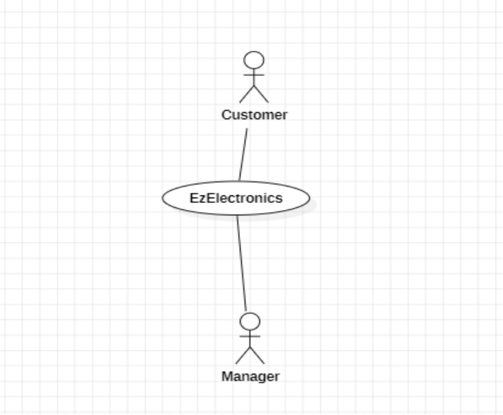
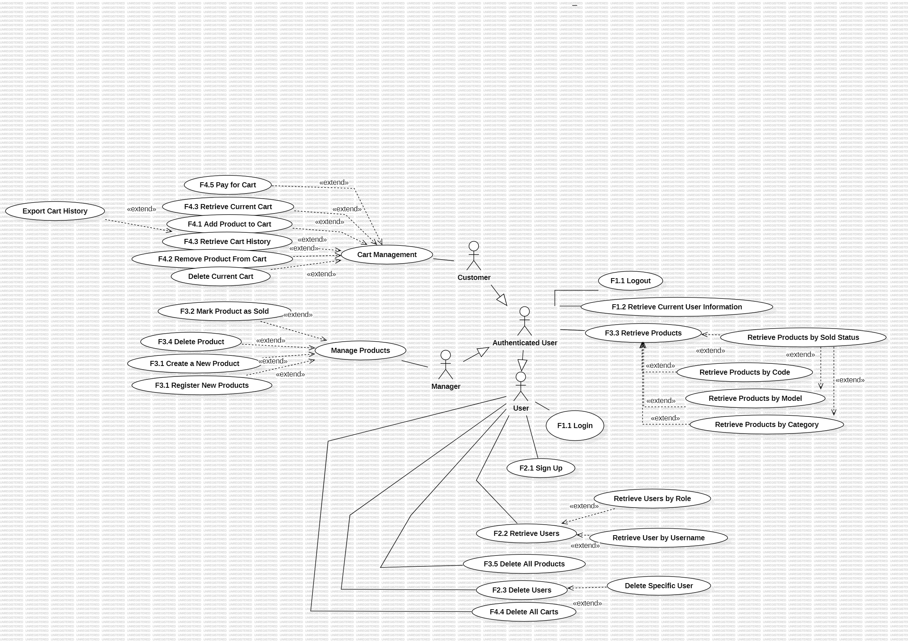
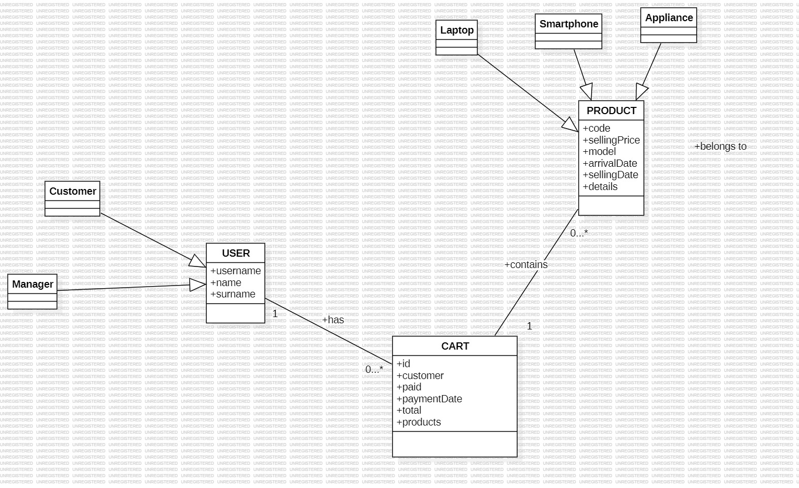
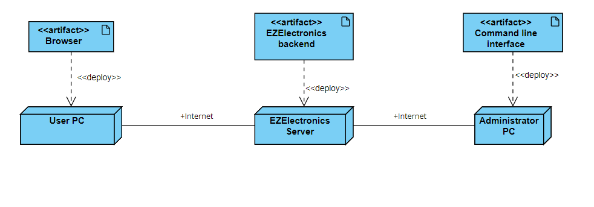

# Requirements Document - current EZElectronics

Date: 29.04.2024

Version: V1 - description of EZElectronics in CURRENT form (as received by teachers)

| Version number | Change |
| :------------: | :----: |
|V2|Completed Requirements.|

# Contents

- [Requirements Document - current EZElectronics](#requirements-document---current-ezelectronics)
- [Contents](#contents)
- [Informal description](#informal-description)
- [Stakeholders](#stakeholders)
- [Context Diagram and interfaces](#context-diagram-and-interfaces)
  - [Context Diagram](#context-diagram)
  - [Interfaces](#interfaces)
- [Stories and personas](#stories-and-personas)
- [Functional and non functional requirements](#functional-and-non-functional-requirements)
  - [Functional Requirements](#functional-requirements)
  - [Non Functional Requirements](#non-functional-requirements)
- [Use case diagram and use cases](#use-case-diagram-and-use-cases)
  - [Use case diagram](#use-case-diagram)
    - [Use case 1, UC1: Sign Up](#use-case-1-uc1-sign-up)
      - [Scenario 1.1: Successful Sign Up](#scenario-11-successful-sign-up)
      - [Scenario 1.2: Sign Up with Existing Username](#scenario-12-sign-up-with-existing-username)
    - [Use case 2, UC2: Login](#use-case-2-uc2-login)
      - [Scenario 2.1: Successful Login](#scenario-21-successful-login)
      - [Scenario 2.2: Login with Incorrect Credentials](#scenario-22-login-with-incorrect-credentials)
    - [Use case 3, UC3: User Logout](#use-case-3-uc3-user-logout)
      - [Scenario 3.1: Successful Logout](#scenario-31-successful-logout)
      - [Scenario 3.2: Logout without Active Session](#scenario-32-logout-without-active-session)
    - [Use case 4, UC4: Retrieve Current User Information](#use-case-4-uc4-retrieve-current-user-information)
      - [Scenario 4.1: Retrieve Logged In User Information](#scenario-41-retrieve-logged-in-user-information)
      - [Scenario 4.2: Error in Retrieving User Information](#scenario-42-error-in-retrieving-user-information)
    - [Use case 5, UC5: Retrieve Users](#use-case-5-uc5-retrieve-users)
      - [Scenario 5.1: Retrieve Full List of Users](#scenario-51-retrieve-full-list-of-users)
      - [Scenario 5.2: Retrieve Users by Role](#scenario-52-retrieve-users-by-role)
      - [Scenario 5.3: Retrieve User by Username](#scenario-53-retrieve-user-by-username)
      - [Scenario 5.4: Error in Retrieving User by Username](#scenario-54-error-in-retrieving-user-by-username)
    - [Use case 6, UC6: Delete User(s)](#use-case-6-uc6-delete-users)
      - [Scenario 6.1: Delete Specific User](#scenario-61-delete-specific-user)
      - [Scenario 6.2: Error in Deleting Specific User](#scenario-62-error-in-deleting-specific-user)
      - [Scenario 6.3: Delete All Users](#scenario-63-delete-all-users)
    - [Use case 7, UC7: Create New Product](#use-case-7-uc7-create-new-product)
      - [Scenario 7.1: Create Specific Product](#scenario-71-create-specific-product)
      - [Scenario 7.2: Error in Creating Specific Product](#scenario-72-error-in-creating-specific-product)
      - [Scenario 7.3: Register Arrivals of Multiple Products](#scenario-73-register-arrivals-of-multiple-products)
      - [Scenario 7.4: Error in Registering Multiple Product Arrivals](#scenario-74-error-in-registering-multiple-product-arrivals)
    - [Use case 8, UC8: Mark Product as Sold](#use-case-8-uc8-mark-product-as-sold)
      - [Scenario 8.1: Mark Specific Product as Sold](#scenario-81-mark-specific-product-as-sold)
      - [Scenario 8.2: Error in Marking Product as Sold](#scenario-82-error-in-marking-product-as-sold)
    - [Use case 9, UC9: Retrieve Products](#use-case-9-uc9-retrieve-products)
      - [Scenario 9.1: Retrieve All Products](#scenario-91-retrieve-all-products)
      - [Scenario 9.2: Retrieve Products by Category](#scenario-92-retrieve-products-by-category)
      - [Scenario 9.3: Error in Retrieving Products](#scenario-93-error-in-retrieving-products)
       - [Use case 10, UC10: Delete All Products](#use-case-10-uc10-delete-all-products)
      - [Scenario 10.1: Delete All Products](#scenario-101-delete-all-products)
    - [Use case 11, UC11: Delete Specific Product](#use-case-11-uc11-delete-specific-product)
      - [Scenario 11.1: Delete Product by Code](#scenario-111-delete-product-by-code)
      - [Scenario 11.2: Error in Deleting Product by Code](#scenario-112-error-in-deleting-product-by-code)
    - [Use case 12, UC12: Retrieve Current Cart](#use-case-12-uc12-retrieve-current-cart)
      - [Scenario 12.1: Retrieve Current Cart](#scenario-121-retrieve-current-cart)
    - [Use case 13, UC13: Add Product to Cart](#use-case-13-uc13-add-product-to-cart)
      - [Scenario 13.1: Add Product to Cart](#scenario-131-add-product-to-cart)
      - [Scenario 13.2: Error in Adding Product to Cart](#scenario-132-error-in-adding-product-to-cart)
    - [Use case 14, UC14: Pay for Cart](#use-case-14-uc14-pay-for-cart)
      - [Scenario 14.1: Pay for Cart](#scenario-141-pay-for-cart)
      - [Scenario 14.2: Error in Paying for Cart](#scenario-142-error-in-paying-for-cart)
    - [Use case 15, UC15: Retrieve Cart History](#use-case-15-uc15-retrieve-cart-history)
      - [Scenario 15.1: Retrieve Cart History](#scenario-151-retrieve-cart-history)
    - [Use case 16, UC16: Remove Product from Cart](#use-case-16-uc16-remove-product-from-cart)
      - [Scenario 16.1: Remove Product from Cart](#scenario-161-remove-product-from-cart)
      - [Scenario 16.2: Error in Removing Product from Cart](#scenario-162-error-in-removing-product-from-cart)
    - [Use case 17, UC17: Delete Current Cart](#use-case-17-uc17-delete-current-cart)
      - [Scenario 17.1: Delete Current Cart](#scenario-171-delete-current-cart)
      - [Scenario 17.2: Error in Deleting Current Cart](#scenario-172-error-in-deleting-current-cart)
    - [Use case 18, UC18: Delete All Carts](#use-case-18-uc18-delete-all-carts)
      - [Scenario 18.1: Delete All Carts](#scenario-181-delete-all-carts)
- [Glossary](#glossary)
- [Deployment Diagram](#deployment-diagram)

# Informal description

EZElectronics (read EaSy Electronics) is a software application designed to help managers of electronics stores to manage their products and offer them to customers through a dedicated website. Managers can assess the available products, record new ones, and confirm purchases. Customers can see available products, add them to a cart and see the history of their past purchases.

# Stakeholders

| Stakeholder name | Description |
| :--------------: | :---------: |
| Customer         | Individuals or entities that purchase electronic products from the store. They interact with the system to browse products, add them to their cart, make purchases, and view their purchase history. |
| Manager          | Responsible for managing the store's inventory, setting prices, overseeing sales, and deleting products. They use the system to add new products, update existing ones, and manage product arrivals. |

# Context Diagram and interfaces

## Context Diagram

## Interfaces

|   Actor   |  Physical Interface  | Logical Interface |
| :-------: | :---------------: | :----------------: |
| Customer  | PC     |GUI                 |
| Manager   | PC     |GUI                 |
# Stories and Personas

**1. Customer Persona: Emily**
Emily, a college student, is well-versed in technology and consistently seeks the newest gadgets for both academic and recreational purposes. She often shops for electronics, prioritizing competitive pricing and effective order tracking. Her primary activities within the system include browsing products, adding items to her shopping cart, completing purchases, and examining her past purchase history.

**2. Manager Persona: John**
John has over a decade of experience managing electronics stores, specializing in inventory management and sales optimization. His primary goals are to manage inventory efficiently and set competitive pricing etc.

# Functional and non functional requirements

## Functional Requirements

|  ID   | Description |
| :---: | :---------: |
|  F1.    |      Access Management       |
|  F1.1  |   Users must be able to login and log out.         |
|F1.2| Users should be able to access and view their own profile information. |
|  F2   | Manage Users                                                 |
| F2.1  | A user can be created with username, name, surname, password and role attributes. |
| F2.2  | All users or some users with specific roles, or according to their usernames should be displayed. |
| F2.3  | Users can be removed either one by one with username or all together.      |
| F2.4  |   The application should support multiple user roles, such as manager and customer, with appropriate permissions for each role.|
|  F3   | Product Management                                           |
| F3.1  | The manager should be able to register the arrival of single or many new products. |
| F3.2  | The manager should mark the sold products.                   |
| F3.3  | Users should be able to display the products according to their ID/model, category, sold information and all products. |
| F3.4  | The manager should be able to delete a product. |
|  F4   | Shopping Cart Management                                     |
| F4.1  | Customers should be able to add products to their shopping cart. |
| F4.2  | Customers should be able to remove products from their shopping cart. |
| F4.3  | Customers should be able to view their current and past shopping carts.|
| F4.4  | Users should be able to delete all shopping carts.|
| F4.5  | Customers should be able to proceed to checkout from the shopping cart. |

## Non Functional Requirements

|   ID    | Type (efficiency, reliability, etc.) | Description                                                                 | Refers to  |
| :-----: | :----------------------------------: | :-------------------------------------------------------------------------- | :--------: |
|  NFR1   | Efficiency                           | The system should handle at least 1000 simultaneous user sessions.          | General         |
|  NFR2   | Reliability                          | The system should be operational 24/7 with a downtime of less than 0.1%.    | General    |
|  NFR3   | Usability                            | All user interfaces should be intuitive and accessible for non-technical users, they should be able to use whole system with 1 hour training. | General         |
|  NFR4   | Scalability                          | The system should be able to scale to support up to 10,000 users without significant changes to the architecture. | General         |
|  NFR5   | Security                             | All user data must be encrypted and comply with GDPR and other relevant data protection regulations. | F1, F2     |

# Use case diagram and use cases

## Use case diagram

### UC1: Sign Up

| Actors Involved  | User                                                                     |
| :--------------: | :------------------------------------------------------------------: |
|   Precondition   | User is not already logged in and does not already have an account. |
|  Post condition  | User account is created.          |
| Nominal Scenario | User navigates to the sign-up page, enters required information, and submits the form. System validates the data, creates an account. |
|     Variants     | None |
|    Exceptions    | User provides existing username.|

#### Scenario 1.1: Successful Sign Up

|  Scenario 1.1  | Description                                                                 |
| :------------: | :------------------------------------------------------------------------: |
|  Precondition  | User is on the sign-up page and has filled out the form with valid data.   |
| Post condition | User account is created.           |
|     Step#      | Description                                                                 |
|       1        | User fills in "username", "email", and "password" in the sign-up form.     |
|       2        | User clicks the "Sign Up" button.                                          |
|       3        | System validates the data and confirms the username is not already in use.    |
|       4        | System creates a new user account.      |

#### Scenario 1.2: Sign Up with Existing Username

| Scenario 1.2  | Description                                                                     |
| :--------------: | :------------------------------------------------------------------: |
|   Precondition   | User is on the sign-up page and inputs a username already associated with another account. |
|  Post condition  | User remains on the sign-up page and is informed of the username conflict.        |
|     Step#      | Description                                                                 |
|       1        | User fills in "username", "email", and "password" in the sign-up form.     |
|       2        | User clicks the "Sign Up" button.                                          |
|       3        | System checks if the username already exists.                              |
|       4        | System detects the username conflict and does not create a new account.    |
|       5        | System displays an error message indicating the username is already in use.|

### UC2: Login
| Actors Involved | User |
| :--------------: | :------------------------------------------------------------------: |
| Precondition | User has an account and is not already logged in. |
| Post condition | User is logged in and redirected to the home page. |
| Nominal Scenario | User navigates to the login page, enters their username and password, and submits the form. System validates the credentials and logs the user in. |
| Variants | None |
| Exceptions | Incorrect username or password.|

#### Scenario 2.1: Successful Login
| Scenario 2.1 | Description |
| :------------: | :------------------------------------------------------------------------: |
| Precondition | User is on the login page and has filled out the form with valid credentials. |
| Post condition | User is logged in and redirected to the Products page. |
| Step# | Description |
| 1 | User fills in "username" and "password" in the login form. |
| 2 | User clicks the "Login" button. |
| 3 | System validates the credentials and confirms they are correct. |
| 4 | System logs the user in and redirects to the Products page. |
#### Scenario 2.2: Login with Incorrect Credentials
| Scenario 2.2 | Description |
| :--------------: | :------------------------------------------------------------------: |
| Precondition | User is on the login page and inputs incorrect username or password. |
| Post condition | User remains on the login page and is informed of the incorrect credentials. |
| Step# | Description |
| 1 | User fills in "username" and "password" in the login form. |
| 2 | User clicks the "Login" button. |
| 3 | System checks the credentials and finds them incorrect. |
| 4 | System does not log the user in and displays an error message indicating incorrect credentials. |
| 5 | System sends the user back to login page.|
### UC 3: User Logout

| Actors Involved | User |
| :--------------: | :------------------------------------------------------------------: |
| Precondition | User is logged in. |
| Post condition | User is logged out and session is terminated. |
| Nominal Scenario | User initiates a clicks to logout. System terminates the current session and logs the user out. |
| Variants | None |
| Exceptions | User is not logged in (session does not exist).|
#### Scenario 3.1: Successful Logout
| Scenario 3.1 | Description |
| :------------: | :------------------------------------------------------------------------: |
| Precondition | User is logged in and has an active session. |
| Post condition | User is logged out and the session is terminated. |
| Step# | Description |
| 1 | User selects the logout option on the interface. |
| 2 | System receives the logout request. |
| 3 | System terminates the session and logs the user out. |
| 4 | System confirms the session has ended and optionally redirects the user to the login page. |

#### Scenario 3.2: Logout without Active Session
| Scenario 3.2 | Description |
| :------------: | :------------------------------------------------------------------------: |
| Precondition | User attempts to log out without being logged in or having an active session. |
| Post condition | No change in state; user remains logged out. |
| Step# | Description |
| 1 | User sends logout request. |
| 2 | System receives the logout request. |
| 3 | System checks for an active session and finds none. |
| 4 | System responds with an error or a message indicating no active session to log out from. |

### UC4: Retrieve Current User Information
| Actors Involved | Logged in User |
| :--------------: | :------------------------------------: |
| Precondition | User is logged in. |
| Post condition | User retrieves their own information. |
| Nominal Scenario | User uses the API to retrieve their own information with show profile button. |
| Variants | None |
| Exceptions | User is not logged in. |

#### Scenario 4.1: Retrieve Logged In User Information
| Scenario 4.1 | Description |
| :------------: | :-----------------------------------------------------------: |
| Precondition | User is authenticated and has an active session. |
| Post condition | User retrieves their own information. |
| Step# | Description |
| 1 | User sends a GET request to retrieve their own information . |
| 2 | System retrieves and shows the information of the currently logged in user. |
| 3 | System returns the User object representing the logged in user. |

#### 4.2: Error in Retrieving User Information
| Scenario 4.2 | Description |
| :------------: | :-----------------------------------------------------------: |
| Precondition | User is not logged in. |
| Post condition | User is informed of the error. |
| Step# | Description |
| 1 | User sends a GET request without being logged in. |
| 2 | System attempts to retrieve the user information. |
| 3 | System returns a 401 error indicating the user is not logged in. |

### UC5: Retrieve Users
| Actors Involved | System Administrator |
| :--------------: | :------------------------------------------------------------------: |
| Precondition | System Administrator is authenticated and wants to retrieve users. |
| Post condition | System Administrator retrieves a list of users. |
| Nominal Scenario | System Administrator uses the API to retrieve the full list of users. |
| Variants | Filter users by role, username |
| Exceptions | Username not found. |
#### Scenario 5.1: Retrieve Full List of Users
| Scenario 5.1 | Description |
| :------------: | :------------------------------------------------------------------------: |
| Precondition | System Administrator is authenticated and wants to retrieve users. |
| Post condition | System Administrator retrieves a list of all users. |
| Step# | Description |
| 1 | System Administrator sends a GET request to retrieve full list of users. |
| 2 | System retrieves the full list of users. |
| 3 | System returns the list of User objects. |

#### 5.2: Retrieve Users by Role
| Scenario 5.2 | Description |
| :------------: | :------------------------------------------------------------------------: |
| Precondition | System Administrator is authenticated and wants to retrieve users by role. |
| Post condition | System Administrator retrieves a list of users with a specific role. |
| Step# | Description |
| 1 | System Administrator sends a GET request to with the desired role. |
| 2 | System retrieves the list of users with the specified role. |
| 3 | System returns the list User objects. |

#### 5.3: Retrieve User by Username
| Scenario 5.3 | Description |
| :------------: | :------------------------------------------------------------------------: |
| Precondition | System Administrator is authenticated and wants to retrieve role. |
| Post condition | System Administrator retrieves a user with a specific username. |
| Step# | Description |
| 1 | System Administrator sends a GET request with the desired username. |
| 2 | System retrieves the user with the specified username. |
| 3 | System returns the User object . |

#### 5.4: Error in Retrieving User by Username
| Scenario 5.4 | Description |
| :------------: | :------------------------------------------------------------------------: |
| Precondition | System Administrator is authenticated and wants to retrieve users by username. |
| Post condition | System Administrator is informed of the error. |
| Step# | Description |
| 1 | System Administrator sends a GET request with the desired username. |
| 2 | System attempts to retrieve the user with the specified username. |
| 3 | If the user does not exist, the system returns a 404 error. |

### UC6: Delete User(s)
| Actors Involved | System Administrator |
| :--------------: | :------------------------------------------------------------------: |
| Precondition | System Administrator is authenticated and wants to delete a user. |
| Post condition | The specified user deleted from the system. |
| Nominal Scenario | System Administrator uses the API to retrieve the full list of users. |
| Variants | Whole users are deleted. |
| Exceptions | Username does not exist. |

#### Scenario 6.1: Delete Specific User
| Scenario 6.1 | Description |
| :------------: | :------------------------------------------------------------------------: |
| Precondition | System Administrator is authenticated and wants to delete a user. |
| Post condition | The specified user is deleted from the system. |
| Step# | Description |
| 1 | System Administrator sends a DELETE request with the username of the user to be deleted. |
| 2 | System deletes the user with the specified username. |
| 3 | System confirms the deletion with a success message. |

#### Scenario 6.2: Error in Deleting Specific User 
| Scenario 6.2 | Description |
| :------------: | :------------------------------------------------------------------------: |
| Precondition | System Administrator is authenticated and wants to delete a user. |
| Post condition | System Administrator is informed of the error.|
| Step# | Description |
| 1 | System Administrator sends a DELETE request with the username of the user to be deleted. |
| 2 | 	If the username does not exist, the system returns a 404 error.|

#### Scenario 6.3: Delete All Users
| Scenario 6.3 | Description |
| :------------: | :------------------------------------------------------------------------: |
| Precondition | System Administrator is authenticated and wants to delete all users. |
| Post condition | All users are deleted from the system. |
| Step# | Description |
| 1 | System Administrator sends a DELETE request. |
| 2 | System deletes all users from the database. |
| 3 | System confirms the deletion with a success message. |

### 7: Create New Product
| Actors Involved | Manager |
| :--------------: | :------------------------------------------------------------------: |
| Precondition | Manager is authenticated and wants to create a new product. |
| Post condition | A new product is created in the system. |
| Nominal Scenario | Manager uses the API to create a new product from the Register new Product(s) page . |
| Variants | Register Arrivals of Multiple Products |
| Exceptions | Product code already exists, Arrival date is after the current date. |
#### Scenario 7.1: Create Specific Product
| Scenario 7.1 | Description |
| :------------: | :------------------------------------------------------------------------: |
| Precondition | Manager is authenticatedand wants to create a new product. |
| Post condition | The specified product is created in the system. |
| Step# | Description |
| 1 | Manager sends a POST request with the product details. |
| 2 | System creates the product with the specified details. |
| 3 | System confirms the creation with a success message including the product code. |
#### Scenario 7.2: Error in Creating Specific Product
| Scenario 7.2 | Description |
| :------------: | :------------------------------------------------------------------------: |
| Precondition | Manager is authenticated and wants to create a new product. |
| Post condition | Manager is informed of the error.|
| Step# | Description |
| 1 | Manager sends a POST request with the product details. |
| 2 | If the product code already exists, the system returns a 409 error. |
| 3 | If the arrival date is after the current date, the system returns an error. |
#### Scenario 7.3: Register Arrivals of Multiple Products
| Scenario 7.3 | Description |
| :------------: | :------------------------------------------------------------------------: |
| Precondition | Manager is authenticated and wants to register arrivals of multiple products. |
| Post condition | The specified set of products is registered in the system. |
| Step# | Description |
| 1 | Manager sends a POST request with the details of the products' arrival. |
| 2 | System registers the arrival of the same products. |
| 3 | System confirms the registration with a success message. |

#### Scenario 7.4: Error in Registering Multiple Product Arrivals
| Scenario 7.4 | Description |
| :------------: | :------------------------------------------------------------------------: |
| Precondition | Manager is authenticated and wants to register arrivals of multiple products. |
| Post condition | Manager is informed of the error.|
| Step# | Description |
| 1 | Manager sends a POST request with the details of the products' arrival. |
| 2 | If the arrival date is after the current date, the system returns an error. |

### UC8: Mark Product as Sold
| Actors Involved | Manager |
| :--------------: | :------------------------------------------------------------------: |
| Precondition | Manager is authenticated and wants to mark product as sold. |
| Post condition | The specified product is marked as sold in the system. |
| Nominal Scenario | Manager uses the API to mark a product as sold from the Mark Product as Sold page. |
| Variants | None. |
| Exceptions | Product code does not exist, selling date is invalid, or product has already been sold. |
#### Scenario 8.1: Mark Specific Product as Sold
| Scenario 8.1 | Description |
| :------------: | :------------------------------------------------------------------------: |
| Precondition | Manager is authenticated and wants to mark product as sold. |
| Post condition | The specified product is marked as sold in the system. |
| Step# | Description |
| 1 | Manager sends a PATCH request with the product code and optional selling date from the Mark products as sold page. |
| 2 | System marks the product as sold with the specified or current date. |
| 3 | System confirms the marking with a success message. |

#### Scenario 8.2: Error in Marking Product as Sold
| Scenario 8.2 | Description |
| :------------: | :------------------------------------------------------------------------: |
| Precondition | Manager is authenticated and wants to mark product as sold. |
| Post condition | Manager is informed of the error.|
| Step# | Description |
| 1 | Manager sends a PATCH request with the product code and optional selling date. |
| 2 | If the product code does not exist, the selling date is invalid, or the product has already been sold, the system returns an appropriate error (404 or other error code).|

### UC9: Retrieve Products
| Actors Involved | User|
| :--------------: | :------------------------------------------------------------------: |
| Precondition | User is authenticated and wants to retrieve products. |
| Post condition | User retrieves a list of products in the system. |
| Nominal Scenario | User sends a GET request to retrieve all products with Products page. |
| Variants | User can filter products based on their sold status (optional), category. model, code. |
| Exceptions | If the product code does not exist the system returns an appropriate error (404 or other error code). |

#### Scenario 10.1: Retrieve All Products
| Scenario 10.1 | Description |
| :------------: | :------------------------------------------------------------------------: |
| Precondition | User is authenticated and wants to retrieve products. |
| Post condition | User retrieves a list of all products in the system. |
| Step# | Description |
| 1 | User sends a GET request to retrieve list of Products. |
| 2 | System retrieves all products from the database. |
| 3 | System returns an array of Product objects representing all products. |
#### Scenario 10.2: Retrieve Products by Sold Status
| Scenario 10.2 | Description |
| :------------: | :------------------------------------------------------------------------: |
| Precondition | User is authenticated and wants to retrieve products bt sodl status. |
| Post condition | User retrieves a list of products filtered by sold status. |
| Step# | Description |
| 1 | User sends a GET request with the query parameter sold=yes or sold=no with a checkbox. |
| 2 | System filters products based on the sold status. |
| 3 | System returns an array of Product objects representing the filtered products. |
#### Scenario 10.3: Retrieve Product by Code
| Scenario 10.3 | Description |
| :------------: | :------------------------------------------------------------------------: |
| Precondition | User is authenticated and wants to retrieve products by code. |
| Post condition | User retrieves details of a specific product. |
| Step# | Description |
| 1 | User sends a GET request with a specific product code from the search bar. |
| 2 | System retrieves the product with the given code. |
| 3 | System returns a Product object representing the requested product. |
| 4 | If the product code does not exist, the system returns a 404 error. |

#### Scenario 10.4: Error in Retrieving Product by Code
| Scenario 10.4 | Description |
| :------------: | :------------------------------------------------------------------------: |
| Precondition | User is authenticated and wants to retrieve products by code.  |
| Post condition | User is informed of the error. |
| Step# | Description |
| 1 | User sends a GET request with a specific product code. |
| 2 | If the product code does not exist, the system returns a 404 error. |

#### Scenario 10.5: Retrieve Products by Category
| Scenario 10.5 | Description |
| :------------: | :------------------------------------------------------------------------: |
| Precondition | User is authenticated and wants to retrieve products by category. |
| Post condition | User retrieves a list of products filtered by category from the selection box. |
| Step# | Description |
| 1 | User sends a GET request with a specific category with optional sold parameter. |
| 2 | System filters products based on the category. |
| 3 | System returns an array of Product objects representing the filtered products. |
#### Scenario 10.6: Retrieve Products by Model
| Scenario 10.6 | Description |
| :------------: | :------------------------------------------------------------------------: |
| Precondition | User is authenticated and wants to retrieve products by model. |
| Post condition | User retrieves a list of products filtered by model with search bar. |
| Step# | Description |
| 1 | User sends a GET request with a specific model with optional sold parameter from the Products page. |
| 2 | System filters products based on the model. |
| 3 | System returns an array of Product objects representing the filtered products. |

### UC10: Delete All Products
| Actors Involved | Administrator |
| :--------------: | :-----------------------------------------------------------: |
| Precondition | Administrator is authenticated and has the necessary permissions, and s/he wants to delete all products. |
| Post condition | All products are deleted from the database. |
| Nominal Scenario | Administrator sends a DELETE request to delete all products. |
| Variants | None |
| Exceptions | None |

### UC11: Delete Specific Product
| Actors Involved | Manager |
| :--------------: | :-----------------------------------------------------------: |
| Precondition | Manager is authenticated and has the necessary permissions, and s/he wants to delete a specific product. |
| Post condition | The specified product is deleted from the database. |
| Nominal Scenario | Manager sends a DELETE request to delete a specific product from the Products page. |
| Variants | None |
| Exceptions | Product code does not exist. |
#### Scenario 11.1: Delete Product by Code
| Scenario 11.1 | Description |
| :------------: | :------------------------------------------------------------------------: |
| Precondition | Manager is authenticated and wants to delete a product by code.|
| Post condition | The specified product is deleted from the system. |
| Step# | Description |
| 1 | Manager sends a DELETE request to with a specific product code from the Products page. |
| 2 | System checks if the product with the given code exists in the database. |
| 3 | System deletes the product. |
|

#### Scenario 11.2: Error in Deleting Product by Code
| Scenario 11.2 | Description |
| :------------: | :------------------------------------------------------------------------: |
| Precondition | Manager is authenticated and wants to delete a product by code.|
| Post condition | Manager is informed of the error. |
| Step# | Description |
| 1 | Manager sends a DELETE request with a specific product code. |
| 2 | System checks if the product with the given code exists in the database.|
| 2 | System checks if the product with the given code exists in the database.|
| 3 | If the product code does not exist, the system returns a 404 error. |

### UC12: Retrieve Current Cart
| Actors Involved | Customer |
| :--------------: | :-----------------------------------------------------------: |
| Precondition | Customer is authenticated and wants to retrieve current cart. |
| Post condition | Customer retrieves the current cart details. |
| Nominal Scenario | Customer sends a GET request to retrieve the current cart with Cart page. |
| Variants | None |
| Exceptions | None |

### UC13: Add Product to Cart
| Actors Involved | Customer |
| :--------------: | :-----------------------------------------------------------: |
| Precondition | Customer is authenticated and wants to add product to cart. |
| Post condition | Product is added to the customer's cart. |
| Nominal Scenario | Customer sends a POST request to add a product to the cart withh add to cart button. |
| Variants | None |
| Exceptions | Product does not exist, product in another cart, Product has been sold. |
#### Scenario 13.1: Add Product to Cart
| Scenario 13.1 | Description |
| :------------: | :------------------------------------------------------------------------: |
| Precondition | Customer is authenticated and wants to add product to cart. |
| Post condition | The specified product is added to the cart. |
| Step# | Description |
| 1 | Customer sends a POST request with a product ID. |
| 2 | System checks if the product exists, is not in another cart, and has not been sold. |
| 3 | System adds the product to the customer's cart. |
#### Scenario 13.2: Error in Adding Product to Cart
| Scenario 13.2 | Description |
| :------------: | :------------------------------------------------------------------------: |
| Precondition | Customer is authenticated and wants to add product to cart |
| Post condition | Customer is informed of the error. |
| Step# | Description |
| 1 | Customer sends a POST request with a product ID. |
| 2 | System checks if the product exists, is not in another cart, and has not been sold. |
| 3 | If any checks fail, the system returns an appropriate error (404 if product does not exist, 409 if product is in another cart or has been sold).

### UC14: Pay for Cart
| Actors Involved | Customer |
| :--------------: | :-----------------------------------------------------------: |
| Precondition | Customer is authenticated and wants to pay for his or her cart. |
| Post condition | The cart is paid for, and the payment date is set. |
| Nominal Scenario | Customer sends a PATCH request to pay for the current cart from the Cart page with clicking Pay. |
| Variants | None |
| Exceptions | User does not have a cart, Cart is empty. |
#### Scenario 14.1: Pay for Cart
| Scenario 14.1 | Description |
| :------------: | :------------------------------------------------------------------------: |
| Precondition | Customer is authenticated and wants to pay for his or her cart. |
| Post condition | The cart is paid for, and the payment date is set to the current date. |
| Step# | Description |
| 1 | Customer sends a PATCH request to pay for the cart. |
| 2 | System calculates the total of the cart as the sum of the costs of all products. |
| 3 | Customer pays the total amount of the cart via Stripe API. |
| 4 | System sets the payment date as the current date. |
| 5 | System confirms the payment with a success message and adds tracking information. |
#### Scenario 14.2: Error in Paying for Cart
| Scenario 14.2 | Description |
| :------------: | :------------------------------------------------------------------------: |
| Precondition | Customer is authenticated and wants to pay for his or her cart. |
| Post condition | Customer is informed of the error. |
| Step# | Description |
| 1 | Customer sends a PATCH request to pay for the cart. |
| 2 | System checks if the customer has a cart and if the cart is not empty. |
| 3 | If the customer does not have a cart or the cart is empty, the system returns a 404 error.

### UC15: Retrieve Cart History
| Actors Involved | Customer |
| :--------------: | :-----------------------------------------------------------: |
| Precondition | Customer is authenticated and wants to retrieve cart history. |
| Post condition | Customer retrieves the history of their paid carts. |
| Nominal Scenario | Customer sends a GET request to retrieve the history of paid carts with Cart History page. |
| Variants | None |
| Exceptions | None |
#### Scenario 15.1: Retrieve Cart History
| Scenario 15.1 | Description |
| :------------: | :------------------------------------------------------------------------: |
| Precondition | Customer is authenticated and wants to retrieve cart history. |
| Post condition | The history of paid carts is retrieved. |
| Step# | Description |
| 1 | Customer sends a GET request to retrieve the history of paid carts. |
| 2 | System retrieves the history of carts that have been paid for by the user. |
| 3 | System returns the history of paid carts. |

### UC16: Remove Product from Cart
| Actors Involved | Customer |
| :--------------: | :-----------------------------------------------------------: |
| Precondition | Customer is authenticated and wants to remove product from cart. |
| Post condition | The specified product is removed from the customer's cart. |
| Nominal Scenario | Customer sends a DELETE request to remove a specific product from the Cart with (-) symbol. |
| Variants | None |
| Exceptions | Product does not exist, Product is not in the cart, Product has been sold, User does not have a cart. |
#### Scenario 16.1: Remove Product from Cart
| Scenario 16.1 | Description |
| :------------: | :------------------------------------------------------------------------: |
| Precondition | Customer is authenticated and wants to remove product from cart. |
| Post condition | The specified product is removed from the cart. |
| Step# | Description |
| 1 | Customer sends a DELETE request with a product ID. |
| 2 | System checks if the customer has a cart. |
| 3 | System checks if the product exists in the cart. |
| 4 | System removes the product from the cart. |
#### Scenario 16.2: Error in Removing Product from Cart
| Scenario 16.2 | Description |
| :------------: | :------------------------------------------------------------------------: |
| Precondition | Customer is authenticated and wants to remove product from cart. |
| Post condition | Customer is informed of the error. |
| Step# | Description |
| 1 | Customer sends a DELETE request with a product ID. |
| 2 | System checks if the customer has a cart. |
| 3 | System checks if the product exists in the cart and if it has not been sold. |
| 4 | If any checks fail (no cart, product does not exist, product not in cart, product sold), the system returns an appropriate error (404 if product or cart does not exist, 409 if product has been sold).

### UC17: Delete Current Cart
| Actors Involved | Customer |
| :--------------: | :-----------------------------------------------------------: |
| Precondition | Customer is authenticated and wants to delete current cart. |
| Post condition | The current cart of the customer is deleted. |
| Nominal Scenario | Customer sends a DELETE request to delete their current cart from the Cart page with Delete Cart button. |
| Variants | None |
| Exceptions | User does not have a cart. |
#### Scenario 17.1: Delete Current Cart
| Scenario 17.1 | Description |
| :------------: | :------------------------------------------------------------------------: |
| Precondition | Customer is authenticated and wants to delete current cart. |
| Post condition | The current cart is deleted. |
| Step# | Description |
| 1 | Customer sends a DELETE request to delete the current cart. |
| 2 | System checks if the customer has a cart. |
| 3 | System deletes the cart. |
| 4 | System confirms the deletion with a success message. |
#### Scenario 17.2: Error in Deleting Current Cart
| Scenario 17.2 | Description |
| :------------: | :------------------------------------------------------------------------: |
| Precondition | Customer is authenticated and wants to delete current cart. |
| Post condition | Customer is informed of the error. |
| Step# | Description |
| 1 | Customer sends a DELETE request to delete the current cart. |
| 2 | System checks if the customer has a cart. |
| 3 | If the customer does not have a cart, the system returns a 404 error.

### UC18: Delete All Carts
| Actors Involved | System Administrator |
| :--------------: | :-----------------------------------------------------------: |
| Precondition | System Administrator is authenticated and wants to delete all carts. |
| Post condition | All carts are deleted from the system. |
| Nominal Scenario | System Administrator sends a DELETE request to delete all carts. |
| Variants | None |
| Exceptions | None |
#### Scenario 18.1: Delete All Carts
| Scenario 18.1 | Description |
| :------------: | :------------------------------------------------------------------------: |
| Precondition | System Administrator is authenticated and wants to delete all carts. |
| Post condition | All carts are deleted from the system. |
| Step# | Description |
| 1 | System Administrator sends a DELETE request to delete all carts. |
| 2 | System deletes all carts. |
| 3 | System confirms the deletion with a success message. |
# Glossary

### Glossary

- **User**: Represents an individual who interacts with the system. Users can be customers or managers each with different roles and permissions.
- **Product**: An item available for purchase or sold in the store.
- **Cart**: A collection of products selected by a customer for purchase, or a collection of products bought by a customer.

# Deployment Diagram

