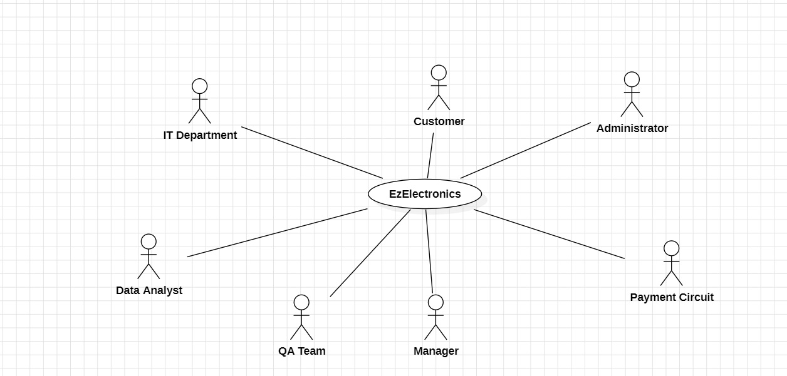
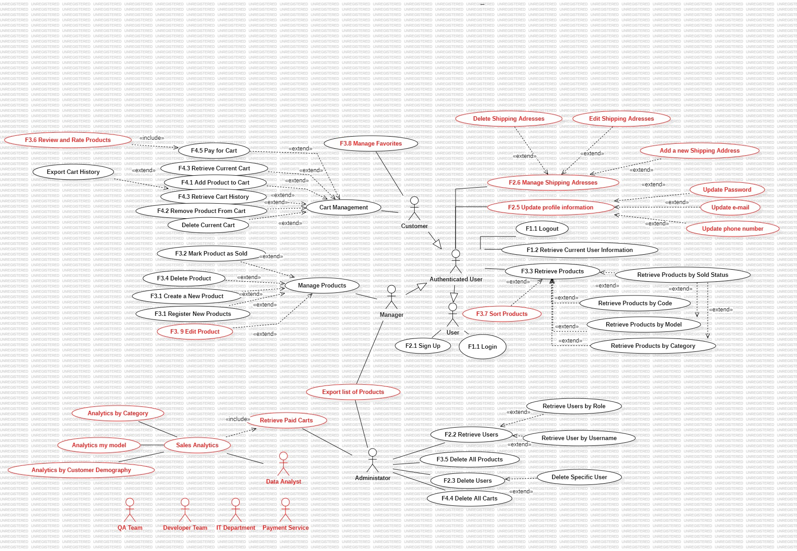
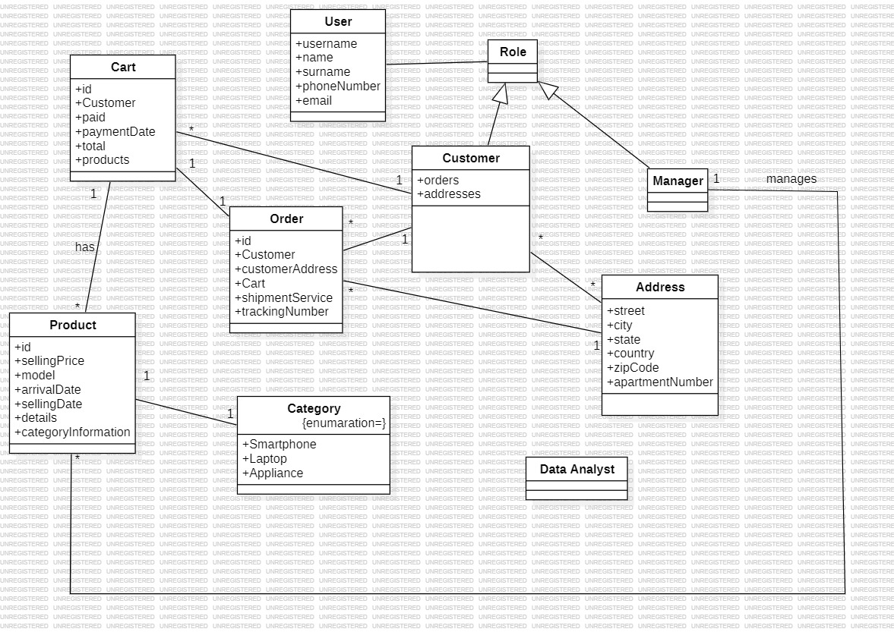
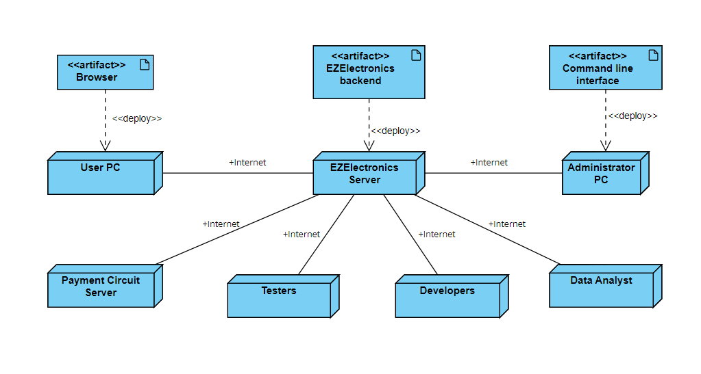

# Requirements Document - FUTURE EZElectronics

Date: 29.04.2024

Version: V1 - description of EZElectronics in FUTURE form (as proposed by the team)

| Version number | Change |
| :------------: | :----: |
|V2|Completed Requirements.|

# Contents

- [Requirements Document - current EZElectronics](#requirements-document---current-ezelectronics)
- [Contents](#contents)
- [Informal description](#informal-description)
- [Stakeholders](#stakeholders)
- [Context Diagram and interfaces](#context-diagram-and-interfaces)
  - [Context Diagram](#context-diagram)
  - [Interfaces](#interfaces)
- [Stories and personas](#stories-and-personas)
- [Functional and non functional requirements](#functional-and-non-functional-requirements)
  - [Functional Requirements](#functional-requirements)
  - [Non Functional Requirements](#non-functional-requirements)
- [Use case diagram and use cases](#use-case-diagram-and-use-cases)
  - [Use case diagram](#use-case-diagram)
    - [Use case 1, UC1: Sign Up](#use-case-1-uc1-sign-up)
      - [Scenario 1.1: Successful Sign Up](#scenario-11-successful-sign-up)
      - [Scenario 1.2: Sign Up with Existing Username](#scenario-12-sign-up-with-existing-username)
    - [Use case 2, UC2: Login](#use-case-2-uc2-login)
      - [Scenario 2.1: Successful Login](#scenario-21-successful-login)
      - [Scenario 2.2: Login with Incorrect Credentials](#scenario-22-login-with-incorrect-credentials)
    - [Use case 3, UC3: User Logout](#use-case-3-uc3-user-logout)
      - [Scenario 3.1: Successful Logout](#scenario-31-successful-logout)
      - [Scenario 3.2: Logout without Active Session](#scenario-32-logout-without-active-session)
    - [Use case 4, UC4: Retrieve Current User Information](#use-case-4-uc4-retrieve-current-user-information)
      - [Scenario 4.1: Retrieve Logged In User Information](#scenario-41-retrieve-logged-in-user-information)
      - [Scenario 4.2: Error in Retrieving User Information](#scenario-42-error-in-retrieving-user-information)
    - [Use case 5, UC5: Retrieve Users](#use-case-5-uc5-retrieve-users)
      - [Scenario 5.1: Retrieve Full List of Users](#scenario-51-retrieve-full-list-of-users)
      - [Scenario 5.2: Retrieve Users by Role](#scenario-52-retrieve-users-by-role)
      - [Scenario 5.3: Retrieve User by Username](#scenario-53-retrieve-user-by-username)
      - [Scenario 5.4: Error in Retrieving User by Username](#scenario-54-error-in-retrieving-user-by-username)
    - [Use case 6, UC6: Delete User(s)](#use-case-6-uc6-delete-users)
      - [Scenario 6.1: Delete Specific User](#scenario-61-delete-specific-user)
      - [Scenario 6.2: Error in Deleting Specific User](#scenario-62-error-in-deleting-specific-user)
      - [Scenario 6.3: Delete All Users](#scenario-63-delete-all-users)
    - [Use case 7, UC7: Create New Product](#use-case-7-uc7-create-new-product)
      - [Scenario 7.1: Create Specific Product](#scenario-71-create-specific-product)
      - [Scenario 7.2: Error in Creating Specific Product](#scenario-72-error-in-creating-specific-product)
      - [Scenario 7.3: Register Arrivals of Multiple Products](#scenario-73-register-arrivals-of-multiple-products)
      - [Scenario 7.4: Error in Registering Multiple Product Arrivals](#scenario-74-error-in-registering-multiple-product-arrivals)
    - [Use case 8, UC8: Mark Product as Sold](#use-case-8-uc8-mark-product-as-sold)
      - [Scenario 8.1: Mark Specific Product as Sold](#scenario-81-mark-specific-product-as-sold)
      - [Scenario 8.2: Error in Marking Product as Sold](#scenario-82-error-in-marking-product-as-sold)
    - [Use case 9, UC9: Retrieve Products](#use-case-9-uc9-retrieve-products)
      - [Scenario 9.1: Retrieve All Products](#scenario-91-retrieve-all-products)
      - [Scenario 9.2: Retrieve Products by Category](#scenario-92-retrieve-products-by-category)
      - [Scenario 9.3: Error in Retrieving Products](#scenario-93-error-in-retrieving-products)
       - [Use case 10, UC10: Delete All Products](#use-case-10-uc10-delete-all-products)
      - [Scenario 10.1: Delete All Products](#scenario-101-delete-all-products)
    - [Use case 11, UC11: Delete Specific Product](#use-case-11-uc11-delete-specific-product)
      - [Scenario 11.1: Delete Product by Code](#scenario-111-delete-product-by-code)
      - [Scenario 11.2: Error in Deleting Product by Code](#scenario-112-error-in-deleting-product-by-code)
    - [Use case 12, UC12: Retrieve Current Cart](#use-case-12-uc12-retrieve-current-cart)
      - [Scenario 12.1: Retrieve Current Cart](#scenario-121-retrieve-current-cart)
    - [Use case 13, UC13: Add Product to Cart](#use-case-13-uc13-add-product-to-cart)
      - [Scenario 13.1: Add Product to Cart](#scenario-131-add-product-to-cart)
      - [Scenario 13.2: Error in Adding Product to Cart](#scenario-132-error-in-adding-product-to-cart)
    - [Use case 14, UC14: Pay for Cart](#use-case-14-uc14-pay-for-cart)
      - [Scenario 14.1: Pay for Cart](#scenario-141-pay-for-cart)
      - [Scenario 14.2: Error in Paying for Cart](#scenario-142-error-in-paying-for-cart)
    - [Use case 15, UC15: Retrieve Cart History](#use-case-15-uc15-retrieve-cart-history)
      - [Scenario 15.1: Retrieve Cart History](#scenario-151-retrieve-cart-history)
    - [Use case 16, UC16: Remove Product from Cart](#use-case-16-uc16-remove-product-from-cart)
      - [Scenario 16.1: Remove Product from Cart](#scenario-161-remove-product-from-cart)
      - [Scenario 16.2: Error in Removing Product from Cart](#scenario-162-error-in-removing-product-from-cart)
    - [Use case 17, UC17: Delete Current Cart](#use-case-17-uc17-delete-current-cart)
      - [Scenario 17.1: Delete Current Cart](#scenario-171-delete-current-cart)
      - [Scenario 17.2: Error in Deleting Current Cart](#scenario-172-error-in-deleting-current-cart)
    - [Use case 18, UC18: Delete All Carts](#use-case-18-uc18-delete-all-carts)
      - [Scenario 18.1: Delete All Carts](#scenario-181-delete-all-carts)
- [Glossary](#glossary)
- [Deployment Diagram](#deployment-diagram)

# Informal description

EZElectronics (read EaSy Electronics) is a software application designed to help managers of electronics stores to manage their products and offer them to customers through a dedicated website. Managers can assess the available products, record new ones, and confirm purchases. Customers can see available products, add them to a cart and see the history of their past purchases.

# Stakeholders

| Stakeholder name | Description |
| :--------------: | :---------: |
| Customer         | Individuals or entities that purchase electronic products from the store. They interact with the system to browse products, add them to their cart, make purchases, and view their purchase history. Customers can be either premium or free users.|
| Manager          | Responsible for managing the store's inventory, setting prices, overseeing sales, and deleting products. They use the system to add new products, update existing ones, and manage product arrivals. |
| Administrator    | Handles the technical and user management aspects of the system, including managing user roles, system settings, ensuring data integrity and security, and overseeing the deletion of users and products. |
| Suppliers         | The companies or individuals who provide the electronics products to be sold on EZElectronics. They ensure that the store has enough inventory by supplying products on time and in the right quantities. |
| IT Department    | Provides technical support and infrastructure for hosting and maintaining the EZElectronics application. They ensure that the necessary hardware, software, and network resources are available and properly configured to support the system. |
| Quality Assurance/Testers    | Responsible for testing the EZElectronics application to identify and report any bugs or issues. They perform various types of testing, including functional testing, usability testing, and performance testing, to ensure the software meets quality standards. |
| Warehouse   | It ensures the storage and preservation of products coming from suppliers. Here, defective products are sorted, packaged and shipped to the store for sale.|
| Warehouse Manager  | Checks for the capacity and defective products, responsible for shipping products to shops. |
| Payment Circuit   | Verifies the credit card information and proceeds the payment. |
|Legal Department | Provides legal guidance and ensures compliance with relevant laws and regulations, such as data protection laws and consumer rights. They review contracts, privacy policies, and terms of service to mitigate legal risks associated with the project.|
|Cargo Company | Delivers the product from suppliers to warehouse. |
|Competitors| Other companies.|

# Context Diagram and interfaces

## Context Diagram

## Interfaces

|   Actor   | Physical Interface | Logical Interface |
| :-------: | :---------------: | :----------------: |
| Customer  | PC     |GUI                 |
| Manager   | PC     |GUI                 |
| Admin     |PC                 |Command Line Interface|
|QA Team|PC|Command Line Interface|
|IT Department|PC|Command Line Interface|
|Payment Circuit|Internet|API|

# Personas and Stories

## Customer - Emma
**Persona**: Emma is a tech enthusiast and a regular customer at EZElectronics. She's always on the lookout for the latest gadgets. As a premium user, she enjoys early access to new releases and exclusive discounts.

**Story**: Emma logs into EZElectronics, browses through the new arrivals, and adds a cutting-edge laptop to her cart. She checks her purchase history to compare with her previous laptop before proceeding to checkout.

## Manager - Lucas
**Persona**: Lucas is the store manager with a keen eye for trends in electronics. He's adept at inventory management and pricing strategies to maximize sales.

**Story**: Lucas reviews sales data and decides to add a new line of gaming laptops to the inventory. He sets competitive prices and updates the product descriptions to highlight their advanced features.

## Administrator - Aisha
**Persona**: Aisha is the system administrator who ensures that EZElectronics runs smoothly. She's a problem-solver and ensures that the system is secure and efficient.

**Story**: Aisha receives an alert about a potential security breach. She quickly investigates, manages user roles, and updates system settings to fortify the system's defenses.

## Supplier - Techtronics Ltd.
**Persona**: Techtronics is a reputable supplier known for its reliable and high-quality electronic components. They pride themselves on timely deliveries.

**Story**: Techtronics receives an order from EZElectronics and dispatches the latest batch of OLED TVs, ensuring they arrive at the warehouse well before the anticipated sales rush.

## IT Department - The Tech Team
**Persona**: The Tech Team is a group of skilled IT professionals dedicated to maintaining the technical backbone of EZElectronics.

**Story**: They perform routine checks on the servers and upgrade the software to ensure the application can handle the increasing number of users during the holiday season.

## Quality Assurance - Nina
**Persona**: Nina is a meticulous QA tester who leaves no stone unturned. She's passionate about delivering a bug-free user experience.

**Story**: Nina conducts usability testing on the new checkout feature and reports a critical bug that could have affected customer transactions.

## Warehouse - EZStorage Facility
**Persona**: EZStorage is a state-of-the-art warehouse that uses smart systems to manage inventory efficiently.

**Story**: The warehouse receives a shipment from Techtronics and uses automated systems to sort and store the products, keeping track of inventory levels in real-time.

## Warehouse Manager - Marco
**Persona**: Marco is an experienced warehouse manager who ensures that every product is accounted for and reaches the stores in perfect condition.

**Story**: Marco notices a discrepancy in the inventory. He investigates, identifies a batch of defective products, and arranges for their return to the supplier.

## Payment Circuit - PaySecure
**Persona**: PaySecure is a trusted payment processor that handles millions of transactions with utmost security.

**Story**: A customer makes a high-value purchase on EZElectronics. PaySecure verifies the transaction details and processes the payment smoothly.

## Legal Department - Legal Eagles
**Persona**: The Legal Eagles are a team of sharp legal minds that protect EZElectronics from potential legal pitfalls.

**Story**: They review a new data protection regulation and update the company's privacy policy to ensure full compliance.

## Cargo Company - QuickShip Logistics
**Persona**: QuickShip Logistics specializes in fast and reliable delivery of goods across the country.

**Story**: QuickShip picks up the latest smartphone shipment from Techtronics and ensures it's delivered to EZStorage within the agreed timeframe.

## Competitors - GadgetWorld
**Persona**: GadgetWorld is a competing electronics retailer that's always trying to outdo EZElectronics with aggressive marketing and pricing.

**Story**: GadgetWorld launches a new advertising campaign, prompting Lucas to analyze their strategy and adjust EZElectronics' marketing efforts to stay ahead.

# Functional and non functional requirements

## Functional Requirements

|  ID   | Description |
| :---: | :---------: |
|  F1.    |      Access Management       |
|  F1.1  |   Users must be able to login and log out.         |
|F1.2| Users should be able to access and view their own profile information. |
|  F2   | Manage Users                                                 |
| F2.1  | A user can be created with username, name, password, VAT number, email, phone number, birth date, and role attributes. Manager role also needs an additional one-time-use code given by administrator.|
| F2.2  | All users or some users with specific roles, or according to their usernames should be displayed. |
| F2.3  | Users can be removed either one by one with username or all together.      |
| F2.4  |   The application should support multiple user roles, such as manager and customer, with appropriate permissions for each role.|
|F2.5|Users should be able to change their profile information (email, password, phone number).|
|F2.6|Option for customers to save multiple shipping addresses.|
|  F3   | Product Management                                           |
| F3.1  | The manager should be able to register the arrival of single or many new products. |
| F3.2  | The manager should mark the sold products.                   |
| F3.3  | Authenticated users should display the products according to their ID/model, category, sold information and all products. |
| F3.4  | The manager should be able to delete a product. |
| F3.5  | The administrator should be able to delete all products. |
|F3.6|Ability for users to leave reviews and rate products.|
|F3.7|Users can sort products by features.|
|F3.8|Customers should be able to add products to their favorites, or remove them.|
|F3.9| Managers should be able to edit the products.|
|  F4   | Shopping Cart Management                                     |
| F4.1  | Customers should be able to add products to their shopping cart. |
| F4.2  | Customers should be able to remove products from their shopping cart. |
| F4.3  | Customers should be able to view their current and past shopping carts.|
| F4.4  | Admnistrator should be able to delete all shopping carts.|
| F4.5  | Customers should be able to proceed to checkout from the shopping cart. |
|F4.6| Administator can retrieve all paid carts.|
|F5|Order Management|
|F5.1|Option for customers to cancel orders before they are shipped.|
|F5.2|Customers should be able to track their orders|
|F6|Analytics and Reporting|
|F6.1| Sales analytics, including total sales, sales by category, and customer demographics.|
|F6.2|Manager should be able to export list of products.|
|F6.3|Customer should be able to export order history.|

## Non Functional Requirements

|   ID    | Type (efficiency, reliability, etc.) | Description                                                                 | Refers to  |
| :-----: | :----------------------------------: | :-------------------------------------------------------------------------- | :--------: |
|  NFR1   | Efficiency                           | The system should handle at least 1000 simultaneous user sessions.          | General         |
|  NFR2   | Reliability                          | The system should be operational 24/7 with a downtime of less than 0.1%.    | General    |
|  NFR3   | Usability                            | All user interfaces should be intuitive and accessible for non-technical users, they should be able to use whole system with 1 hour training. | General         |
|  NFR4   | Scalability                          | The system should be able to scale to support up to 10,000 users without significant changes to the architecture. | General         |
|  NFR5   | Security                             | All user data must be encrypted and comply with GDPR and other relevant data protection regulations. | F1, F2     |

# Use case diagram and use cases

## Use case diagram

### UC1: Sign Up

| Actors Involved  | User                                                                     |
| :--------------: | :------------------------------------------------------------------: |
|   Precondition   | User is not already logged in and does not already have an account. |
|  Post condition  | User account is created.          |
| Nominal Scenario | User navigates to the sign-up page, enters required information, and submits the form. System validates the data, creates an account. |
|     Variants     | None |
|    Exceptions    | User provides existing username, e-mail, phone number or VAT number.|

#### Scenario 1.1: Successful Sign Up

|  Scenario 1.1  | Description                                                                 |
| :------------: | :------------------------------------------------------------------------: |
|  Precondition  | User is on the sign-up page and has filled out the form with valid data.   |
| Post condition | User account is created.           |
|     Step#      | Description                                                                 |
|       1        | User cilcks to register from login page and fills in  username, name, password, VAT number, email, phone number, birth date, role and one-time-code (for managers) attributes in the sign-up form.   |
|       2        | User clicks the "Register" button.                                          |
|       3        | System validates the data and confirms the username, VAT number, email, phone numbe  is not already in use.    |
|       4        | System creates a new user account.      |

#### Scenario 1.2: Sign Up with Existing Username, VAT number, Phone Number or E-mail

| Scenario 1.2  | Description                                                                     |
| :--------------: | :------------------------------------------------------------------: |
|   Precondition   | User is on the sign-up page and inputs a username already associated with another account. |
|  Post condition  | User remains on the sign-up page and is informed of the username conflict.        |
|     Step#      | Description                                                                 |
|       1        | User fills in username, name, password, VAT number, email, phone number, birth date, and role attributes in the sign-up form.     |
|       2        | User clicks the "Register" button.                                          |
|       3        | System checks if the username, VAT number, email or phone number already exists.                              |
|       4        | System detects the conflicts and does not create a new account.    |
|       5        | System displays an error message indicating the field which is already in use.|

#### Scenario 1.3: Invalid One-Time-Use Code
| Scenario 1.3  | Description                                                                     |
| :--------------: | :------------------------------------------------------------------: |
|   Precondition   | User is on the sign-up page and inputs a one-time-use code for the manager role that is not recognized. |
|  Post condition  | User remains on the sign-up page and is informed of the invalid code.        |
|     Step#      | Description                                                                 |
|       1        | User fills in username, name, password, VAT number, email, phone number, birth date, and role attributes in the sign-up form.     |
|       2        | User clicks the "Register" button.                                          |
|       3        | System checks if the one-time-use code for the manager role is valid.                              |
|       4        | System detects the invalid code and does not create a new account.    |
|       5        | System displays an error message indicating the one-time-use code is invalid.|

### UC2: Login
| Actors Involved | User |
| :--------------: | :------------------------------------------------------------------: |
| Precondition | User has an account and is not already logged in. |
| Post condition | User is logged in and redirected to the Products page. |
| Nominal Scenario | User navigates to the login page, enters their username and password, and submits the form. System validates the credentials and logs the user in. |
| Variants | None |
| Exceptions | Incorrect username or password.|

#### Scenario 2.1: Successful Login
| Scenario 2.1 | Description |
| :------------: | :------------------------------------------------------------------------: |
| Precondition | User is on the login page and has filled out the form with valid credentials. |
| Post condition | User is logged in and redirected to the Products page. |
| Step# | Description |
| 1 | User fills in "username" and "password" in the login form. |
| 2 | User clicks the "Login" button. |
| 3 | System validates the credentials and confirms they are correct. |
| 4 | System logs the user in and redirects to the Products page. |
#### Scenario 2.2: Login with Incorrect Credentials
| Scenario 2.2 | Description |
| :--------------: | :------------------------------------------------------------------: |
| Precondition | User is on the login page and inputs incorrect username or password. |
| Post condition | User remains on the login page and is informed of the incorrect credentials. |
| Step# | Description |
| 1 | User fills in "username" and "password" in the login form. |
| 2 | User clicks the "Login" button. |
| 3 | System checks the credentials and finds them incorrect. |
| 4 | System does not log the user in and displays an error message indicating incorrect credentials. |
| 5 | System sends the user back to login page.|
### UC 3: User Logout

| Actors Involved | User |
| :--------------: | :------------------------------------------------------------------: |
| Precondition | User is logged in. |
| Post condition | User is logged out and session is terminated. |
| Nominal Scenario | User initiates a clicks to logout. System terminates the current session and logs the user out. |
| Variants | None |
| Exceptions | User is not logged in (session does not exist).|
#### Scenario 3.1: Successful Logout
| Scenario 3.1 | Description |
| :------------: | :------------------------------------------------------------------------: |
| Precondition | User is logged in and has an active session. |
| Post condition | User is logged out and the session is terminated. |
| Step# | Description |
| 1 | User selects the logout option on the interface. |
| 2 | System receives the logout request. |
| 3 | System terminates the session and logs the user out. |
| 4 | System confirms the session has ended and optionally redirects the user to the login page. |

#### Scenario 3.2: Logout without Active Session
| Scenario 3.2 | Description |
| :------------: | :------------------------------------------------------------------------: |
| Precondition | User attempts to log out without being logged in or having an active session. |
| Post condition | No change in state; user remains logged out. |
| Step# | Description |
| 1 | User sends logout request. |
| 2 | System receives the logout request. |
| 3 | System checks for an active session and finds none. |
| 4 | System responds with an error or a message indicating no active session to log out from. |

### UC4: Retrieve Current User Information
| Actors Involved | Logged in User |
| :--------------: | :------------------------------------: |
| Precondition | User is logged in. |
| Post condition | User retrieves their own information. |
| Nominal Scenario | User uses the API to retrieve their own information with show profile button. |
| Variants | None |
| Exceptions | User is not logged in. |

#### Scenario 4.1: Retrieve Logged In User Information
| Scenario 4.1 | Description |
| :------------: | :-----------------------------------------------------------: |
| Precondition | User is authenticated and has an active session. |
| Post condition | User retrieves their own information. |
| Step# | Description |
| 1 | User sends a GET request to retrieve their own information . |
| 2 | System retrieves and shows the information of the currently logged in user. |
| 3 | System returns the User object representing the logged in user. |

#### 4.2: Error in Retrieving User Information
| Scenario 4.2 | Description |
| :------------: | :-----------------------------------------------------------: |
| Precondition | User is not logged in. |
| Post condition | User is informed of the error. |
| Step# | Description |
| 1 | User sends a GET request without being logged in. |
| 2 | System attempts to retrieve the user information. |
| 3 | System returns a 401 error indicating the user is not logged in. |

### UC5: Retrieve Users
| Actors Involved | System Administrator |
| :--------------: | :------------------------------------------------------------------: |
| Precondition | System Administrator is authenticated and wants to retrieve users. |
| Post condition | System Administrator retrieves a list of users. |
| Nominal Scenario | System Administrator uses the API to retrieve the full list of users. |
| Variants | Filter users by role, username |
| Exceptions | Username not found. |
#### Scenario 5.1: Retrieve Full List of Users
| Scenario 5.1 | Description |
| :------------: | :------------------------------------------------------------------------: |
| Precondition | System Administrator is authenticated and wants to retrieve users. |
| Post condition | System Administrator retrieves a list of all users. |
| Step# | Description |
| 1 | System Administrator sends a GET request to retrieve full list of users. |
| 2 | System retrieves the full list of users. |
| 3 | System returns the list of User objects. |

#### 5.2: Retrieve Users by Role
| Scenario 5.2 | Description |
| :------------: | :------------------------------------------------------------------------: |
| Precondition | System Administrator is authenticated and wants to retrieve users by role. |
| Post condition | System Administrator retrieves a list of users with a specific role. |
| Step# | Description |
| 1 | System Administrator sends a GET request to with the desired role. |
| 2 | System retrieves the list of users with the specified role. |
| 3 | System returns the list User objects. |

#### 5.3: Retrieve User by Username
| Scenario 5.3 | Description |
| :------------: | :------------------------------------------------------------------------: |
| Precondition | System Administrator is authenticated and wants to retrieve role. |
| Post condition | System Administrator retrieves a user with a specific username. |
| Step# | Description |
| 1 | System Administrator sends a GET request with the desired username. |
| 2 | System retrieves the user with the specified username. |
| 3 | System returns the User object . |

#### 5.4: Error in Retrieving User by Username
| Scenario 5.4 | Description |
| :------------: | :------------------------------------------------------------------------: |
| Precondition | System Administrator is authenticated and wants to retrieve users by username. |
| Post condition | System Administrator is informed of the error. |
| Step# | Description |
| 1 | System Administrator sends a GET request with the desired username. |
| 2 | System attempts to retrieve the user with the specified username. |
| 3 | If the user does not exist, the system returns a 404 error. |

### UC6: Delete User(s)
| Actors Involved | System Administrator |
| :--------------: | :------------------------------------------------------------------: |
| Precondition | System Administrator is authenticated and wants to delete a user. |
| Post condition | The specified user deleted from the system. |
| Nominal Scenario | System Administrator uses the API to retrieve the full list of users. |
| Variants | Whole users are deleted. |
| Exceptions | Username does not exist. |

#### Scenario 6.1: Delete Specific User
| Scenario 6.1 | Description |
| :------------: | :------------------------------------------------------------------------: |
| Precondition | System Administrator is authenticated and wants to delete a user. |
| Post condition | The specified user is deleted from the system. |
| Step# | Description |
| 1 | System Administrator sends a DELETE request with the username of the user to be deleted. |
| 2 | System deletes the user with the specified username. |
| 3 | System confirms the deletion with a success message. |

#### Scenario 6.2: Error in Deleting Specific User 
| Scenario 6.2 | Description |
| :------------: | :------------------------------------------------------------------------: |
| Precondition | System Administrator is authenticated and wants to delete a user. |
| Post condition | System Administrator is informed of the error.|
| Step# | Description |
| 1 | System Administrator sends a DELETE request with the username of the user to be deleted. |
| 2 | 	If the username does not exist, the system returns a 404 error.|

#### Scenario 6.3: Delete All Users
| Scenario 6.3 | Description |
| :------------: | :------------------------------------------------------------------------: |
| Precondition | System Administrator is authenticated and wants to delete all users. |
| Post condition | All users are deleted from the system. |
| Step# | Description |
| 1 | System Administrator sends a DELETE request. |
| 2 | System deletes all users from the database. |
| 3 | System confirms the deletion with a success message. |

### 7: Create New Product
| Actors Involved | Manager |
| :--------------: | :------------------------------------------------------------------: |
| Precondition | Manager is authenticated and wants to create a new product. |
| Post condition | A new product is created in the system. |
| Nominal Scenario | Manager uses the API to create a new product from the Register new Product(s) page . |
| Variants | Register Arrivals of Multiple Products |
| Exceptions | Product code already exists, Arrival date is after the current date. |
#### Scenario 7.1: Create Specific Product
| Scenario 7.1 | Description |
| :------------: | :------------------------------------------------------------------------: |
| Precondition | Manager is authenticatedand wants to create a new product. |
| Post condition | The specified product is created in the system. |
| Step# | Description |
| 1 | Manager sends a POST request with the product details. |
| 2 | System creates the product with the specified details. |
| 3 | System confirms the creation with a success message including the product code. |
#### Scenario 7.2: Error in Creating Specific Product
| Scenario 7.2 | Description |
| :------------: | :------------------------------------------------------------------------: |
| Precondition | Manager is authenticated and wants to create a new product. |
| Post condition | Manager is informed of the error.|
| Step# | Description |
| 1 | Manager sends a POST request with the product details. |
| 2 | If the product code already exists, the system returns a 409 error. |
| 3 | If the arrival date is after the current date, the system returns an error. |
#### Scenario 7.3: Register Arrivals of Multiple Products
| Scenario 7.3 | Description |
| :------------: | :------------------------------------------------------------------------: |
| Precondition | Manager is authenticated and wants to register arrivals of multiple products. |
| Post condition | The specified set of products is registered in the system. |
| Step# | Description |
| 1 | Manager sends a POST request with the details of the products' arrival. |
| 2 | System registers the arrival of the same products. |
| 3 | System confirms the registration with a success message. |

#### Scenario 7.4: Error in Registering Multiple Product Arrivals
| Scenario 7.4 | Description |
| :------------: | :------------------------------------------------------------------------: |
| Precondition | Manager is authenticated and wants to register arrivals of multiple products. |
| Post condition | Manager is informed of the error.|
| Step# | Description |
| 1 | Manager sends a POST request with the details of the products' arrival. |
| 2 | If the arrival date is after the current date, the system returns an error. |

### UC8: Mark Product as Sold
| Actors Involved | Manager |
| :--------------: | :------------------------------------------------------------------: |
| Precondition | Manager is authenticated and wants to mark product as sold. |
| Post condition | The specified product is marked as sold in the system. |
| Nominal Scenario | Manager uses the API to mark a product as sold from the Mark Product as Sold page. |
| Variants | None. |
| Exceptions | Product code does not exist, selling date is invalid, or product has already been sold. |
#### Scenario 8.1: Mark Specific Product as Sold
| Scenario 8.1 | Description |
| :------------: | :------------------------------------------------------------------------: |
| Precondition | Manager is authenticated and wants to mark product as sold. |
| Post condition | The specified product is marked as sold in the system. |
| Step# | Description |
| 1 | Manager sends a PATCH request with the product code and optional selling date from the Mark products as sold page. |
| 2 | System marks the product as sold with the specified or current date. |
| 3 | System confirms the marking with a success message. |

#### Scenario 8.2: Error in Marking Product as Sold
| Scenario 8.2 | Description |
| :------------: | :------------------------------------------------------------------------: |
| Precondition | Manager is authenticated and wants to mark product as sold. |
| Post condition | Manager is informed of the error.|
| Step# | Description |
| 1 | Manager sends a PATCH request with the product code and optional selling date. |
| 2 | If the product code does not exist, the selling date is invalid, or the product has already been sold, the system returns an appropriate error (404 or other error code).|

### UC9: Retrieve Products
| Actors Involved | User|
| :--------------: | :------------------------------------------------------------------: |
| Precondition | User is authenticated and wants to retrieve products. |
| Post condition | User retrieves a list of products in the system. |
| Nominal Scenario | User sends a GET request to retrieve all products with Products page. |
| Variants | User can filter products based on their sold status (optional), category. model, code. |
| Exceptions | If the product code does not exist the system returns an appropriate error (404 or other error code). |

#### Scenario 10.1: Retrieve All Products
| Scenario 10.1 | Description |
| :------------: | :------------------------------------------------------------------------: |
| Precondition | User is authenticated and wants to retrieve products. |
| Post condition | User retrieves a list of all products in the system. |
| Step# | Description |
| 1 | User sends a GET request to retrieve list of Products. |
| 2 | System retrieves all products from the database. |
| 3 | System returns an array of Product objects representing all products. |
#### Scenario 10.2: Retrieve Products by Sold Status
| Scenario 10.2 | Description |
| :------------: | :------------------------------------------------------------------------: |
| Precondition | User is authenticated and wants to retrieve products bt sodl status. |
| Post condition | User retrieves a list of products filtered by sold status. |
| Step# | Description |
| 1 | User sends a GET request with the query parameter sold=yes or sold=no with a checkbox. |
| 2 | System filters products based on the sold status. |
| 3 | System returns an array of Product objects representing the filtered products. |
#### Scenario 10.3: Retrieve Product by Code
| Scenario 10.3 | Description |
| :------------: | :------------------------------------------------------------------------: |
| Precondition | User is authenticated and wants to retrieve products by code. |
| Post condition | User retrieves details of a specific product. |
| Step# | Description |
| 1 | User sends a GET request with a specific product code from the search bar. |
| 2 | System retrieves the product with the given code. |
| 3 | System returns a Product object representing the requested product. |
| 4 | If the product code does not exist, the system returns a 404 error. |

#### Scenario 10.4: Error in Retrieving Product by Code
| Scenario 10.4 | Description |
| :------------: | :------------------------------------------------------------------------: |
| Precondition | User is authenticated and wants to retrieve products by code.  |
| Post condition | User is informed of the error. |
| Step# | Description |
| 1 | User sends a GET request with a specific product code. |
| 2 | If the product code does not exist, the system returns a 404 error. |

#### Scenario 10.5: Retrieve Products by Category
| Scenario 10.5 | Description |
| :------------: | :------------------------------------------------------------------------: |
| Precondition | User is authenticated and wants to retrieve products by category. |
| Post condition | User retrieves a list of products filtered by category from the selection box. |
| Step# | Description |
| 1 | User sends a GET request with a specific category with optional sold parameter. |
| 2 | System filters products based on the category. |
| 3 | System returns an array of Product objects representing the filtered products. |
#### Scenario 10.6: Retrieve Products by Model
| Scenario 10.6 | Description |
| :------------: | :------------------------------------------------------------------------: |
| Precondition | User is authenticated and wants to retrieve products by model. |
| Post condition | User retrieves a list of products filtered by model with search bar. |
| Step# | Description |
| 1 | User sends a GET request with a specific model with optional sold parameter from the Products page. |
| 2 | System filters products based on the model. |
| 3 | System returns an array of Product objects representing the filtered products. |

### UC10: Delete All Products
| Actors Involved | Administrator |
| :--------------: | :-----------------------------------------------------------: |
| Precondition | Administrator is authenticated and has the necessary permissions, and s/he wants to delete all products. |
| Post condition | All products are deleted from the database. |
| Nominal Scenario | Administrator sends a DELETE request to delete all products. |
| Variants | None |
| Exceptions | None |

### UC11: Delete Specific Product
| Actors Involved | Manager |
| :--------------: | :-----------------------------------------------------------: |
| Precondition | Manager is authenticated and has the necessary permissions, and s/he wants to delete a specific product. |
| Post condition | The specified product is deleted from the database. |
| Nominal Scenario | Manager sends a DELETE request to delete a specific product. |
| Variants | None |
| Exceptions | Product code does not exist. |
#### Scenario 11.1: Delete Product by Code
| Scenario 11.1 | Description |
| :------------: | :------------------------------------------------------------------------: |
| Precondition | Manager is authenticated and wants to delete a product by code.|
| Post condition | The specified product is deleted from the system. |
| Step# | Description |
| 1 | Manager sends a DELETE request to with a specific product code from the Products page. |
| 2 | System checks if the product with the given code exists in the database. |
| 3 | System deletes the product. |
|

#### Scenario 11.2: Error in Deleting Product by Code
| Scenario 11.2 | Description |
| :------------: | :------------------------------------------------------------------------: |
| Precondition | Manager is authenticated and wants to delete a product by code.|
| Post condition | Manager is informed of the error. |
| Step# | Description |
| 1 | Manager sends a DELETE request with a specific product code from the Products page. |
| 2 | System checks if the product with the given code exists in the database.|
| 3 | If the product code does not exist, the system returns a 404 error. |

### UC12: Retrieve Current Cart
| Actors Involved | Customer |
| :--------------: | :-----------------------------------------------------------: |
| Precondition | Customer is authenticated and wants to retrieve current cart. |
| Post condition | Customer retrieves the current cart details. |
| Nominal Scenario | Customer sends a GET request to retrieve the current cart with Cart page. |
| Variants | None |
| Exceptions | None |

### UC13: Add Product to Cart
| Actors Involved | Customer |
| :--------------: | :-----------------------------------------------------------: |
| Precondition | Customer is authenticated and wants to add product to cart. |
| Post condition | Product is added to the customer's cart. |
| Nominal Scenario | Customer sends a POST request to add a product to the cart withh add to cart button. |
| Variants | None |
| Exceptions | Product does not exist, Product has been sold. |
#### Scenario 13.1: Add Product to Cart
| Scenario 13.1 | Description |
| :------------: | :------------------------------------------------------------------------: |
| Precondition | Customer is authenticated and wants to add product to cart. |
| Post condition | The specified product is added to the cart. |
| Step# | Description |
| 1 | Customer sends a POST request with a product ID. |
| 2 | System checks if the product exists, is not in another cart, and has not been sold. |
| 3 | System adds the product to the customer's cart. |
#### Scenario 13.2: Error in Adding Product to Cart
| Scenario 13.2 | Description |
| :------------: | :------------------------------------------------------------------------: |
| Precondition | Customer is authenticated and wants to add product to cart |
| Post condition | Customer is informed of the error. |
| Step# | Description |
| 1 | Customer sends a POST request with a product ID. |
| 2 | System checks if the product exists, is not in another cart, and has not been sold. |
| 3 | If any checks fail, the system returns an appropriate error (404 if product does not exist or has been sold).

### UC14: Pay for Cart
| Actors Involved | Customer |
| :--------------: | :-----------------------------------------------------------: |
| Precondition | Customer is authenticated and wants to pay for his or her cart. |
| Post condition | The cart is paid for, and the payment date is set. |
| Nominal Scenario | Customer sends a PATCH request to pay for the current cart from the Cart page with clicking Pay. |
| Variants | None |
| Exceptions | User does not have a cart, Cart is empty. |
#### Scenario 14.1: Pay for Cart
| Scenario 14.1 | Description |
| :------------: | :------------------------------------------------------------------------: |
| Precondition | Customer is authenticated and wants to pay for his or her cart. |
| Post condition | The cart is paid for, and the payment date is set to the current date. |
| Step# | Description |
| 1 | Customer sends a PATCH request to pay for the cart. |
| 2 | System calculates the total of the cart as the sum of the costs of all products. |
| 3 | Customer pays the total amount of the cart via Stripe API. |
| 4 | System sets the payment date as the current date. |
| 5 | System confirms the payment with a success message and adds tracking information. |
#### Scenario 14.2: Error in Paying for Cart
| Scenario 14.2 | Description |
| :------------: | :------------------------------------------------------------------------: |
| Precondition | Customer is authenticated and wants to pay for his or her cart. |
| Post condition | Customer is informed of the error. |
| Step# | Description |
| 1 | Customer sends a PATCH request to pay for the cart. |
| 2 | System checks if the customer has a cart and if the cart is not empty. |
| 3 | If the customer does not have a cart or the cart is empty, the system returns a 404 error.

### UC15: Retrieve Cart History
| Actors Involved | Customer |
| :--------------: | :-----------------------------------------------------------: |
| Precondition | Customer is authenticated and wants to retrieve cart history. |
| Post condition | Customer retrieves the history of their paid carts. |
| Nominal Scenario | Customer sends a GET request to retrieve the history of paid carts with Cart History page. |
| Variants | None |
| Exceptions | None |
#### Scenario 15.1: Retrieve Cart History
| Scenario 15.1 | Description |
| :------------: | :------------------------------------------------------------------------: |
| Precondition | Customer is authenticated and wants to retrieve cart history. |
| Post condition | The history of paid carts is retrieved. |
| Step# | Description |
| 1 | Customer sends a GET request to retrieve the history of paid carts. |
| 2 | System retrieves the history of carts that have been paid for by the user. |
| 3 | System returns the history of paid carts. |

### UC16: Remove Product from Cart
| Actors Involved | Customer |
| :--------------: | :-----------------------------------------------------------: |
| Precondition | Customer is authenticated and wants to remove product from cart. |
| Post condition | The specified product is removed from the customer's cart. |
| Nominal Scenario | Customer sends a DELETE request to remove a specific product from the Cart with (-) symbol. |
| Variants | None |
| Exceptions | Product does not exist, Product is not in the cart, Product has been sold, User does not have a cart. |
#### Scenario 16.1: Remove Product from Cart
| Scenario 16.1 | Description |
| :------------: | :------------------------------------------------------------------------: |
| Precondition | Customer is authenticated and wants to remove product from cart. |
| Post condition | The specified product is removed from the cart. |
| Step# | Description |
| 1 | Customer sends a DELETE request with a product ID. |
| 2 | System checks if the customer has a cart. |
| 3 | System checks if the product exists in the cart. |
| 4 | System removes the product from the cart. |
#### Scenario 16.2: Error in Removing Product from Cart
| Scenario 16.2 | Description |
| :------------: | :------------------------------------------------------------------------: |
| Precondition | Customer is authenticated and wants to remove product from cart. |
| Post condition | Customer is informed of the error. |
| Step# | Description |
| 1 | Customer sends a DELETE request with a product ID. |
| 2 | System checks if the customer has a cart. |
| 3 | System checks if the product exists in the cart and if it has not been sold. |
| 4 | If any checks fail (no cart, product does not exist, product not in cart, product sold), the system returns an appropriate error (404 if product or cart does not exist, 409 if product has been sold).

### UC17: Delete Current Cart
| Actors Involved | Customer |
| :--------------: | :-----------------------------------------------------------: |
| Precondition | Customer is authenticated and wants to delete current cart. |
| Post condition | The current cart of the customer is deleted. |
| Nominal Scenario | Customer sends a DELETE request to delete their current cart from the Cart page with Delete Cart button. |
| Variants | None |
| Exceptions | User does not have a cart. |
#### Scenario 17.1: Delete Current Cart
| Scenario 17.1 | Description |
| :------------: | :------------------------------------------------------------------------: |
| Precondition | Customer is authenticated and wants to delete current cart. |
| Post condition | The current cart is deleted. |
| Step# | Description |
| 1 | Customer sends a DELETE request to delete the current cart. |
| 2 | System checks if the customer has a cart. |
| 3 | System deletes the cart. |
| 4 | System confirms the deletion with a success message. |
#### Scenario 17.2: Error in Deleting Current Cart
| Scenario 17.2 | Description |
| :------------: | :------------------------------------------------------------------------: |
| Precondition | Customer is authenticated and wants to delete current cart. |
| Post condition | Customer is informed of the error. |
| Step# | Description |
| 1 | Customer sends a DELETE request to delete the current cart. |
| 2 | System checks if the customer has a cart. |
| 3 | If the customer does not have a cart, the system returns a 404 error.

### UC18: Delete All Carts
| Actors Involved | System Administrator |
| :--------------: | :-----------------------------------------------------------: |
| Precondition | System Administrator is authenticated and wants to delete all carts. |
| Post condition | All carts are deleted from the system. |
| Nominal Scenario | System Administrator sends a DELETE request to delete all carts. |
| Variants | None |
| Exceptions | None |
#### Scenario 18.1: Delete All Carts
| Scenario 18.1 | Description |
| :------------: | :------------------------------------------------------------------------: |
| Precondition | System Administrator is authenticated and wants to delete all carts. |
| Post condition | All carts are deleted from the system. |
| Step# | Description |
| 1 | System Administrator sends a DELETE request to delete all carts. |
| 2 | System deletes all carts. |
| 3 | System confirms the deletion with a success message. |

### UC19: Profile Update (E-mail, password or phone number)
| Actors Involved | Logged in User |
| :--------------: | :------------------------------------: |
| Precondition | User is logged in and wants to update his or her profile. |
| Post condition | User updated his or her profile information. |
| Nominal Scenario | User uses the API to update his or her profile information from the Show Profile page with Change Information button . |
| Variants | None |
| Exceptions | Invalid Field. |
#### Scenario 19.1: Successful Email Update
| Scenario 19.1 | Description |
| :--------- | :---------- |
| Precondition | User is logged in and on the profile settings page. |
| Postcondition | User's email is updated successfully. |
| Step# | Description |
|1| User clicks to change information button.|
| 2 | User updates their email to "newemail@example.com". |
| 3 | User submits the changes. |
| 4 | System validates the new email format. |
| 5 | System updates the email in the database. |
| 6 | System displays a confirmation message to the user. |
#### Scenario 19.2: Successful Password Update
| Scenario 19.2 | Description |
| :--------- | :---------- |
| Precondition | User is logged in and on the profile settings page. |
| Postcondition | User's password is updated successfully. |
| Step# | Description |
|1| User clicks to  change information button.|
| 2 | User updates their password to "NewSecurePassword123!". |
| 3 | User submits the changes. |
| 4 | System validates the new password against security requirements. |
| 5 | System updates the password in the database. |
| 6 | System displays a confirmation message to the user. |

#### Scenario 19.3: Successful Phone Number Update
| Scenario 19.3 | Description |
| :--------- | :---------- |
| Precondition | User is logged in and on the profile settings page. |
| Postcondition | User's phone number is updated successfully. |
| Step# | Description |
| 1 | User clicks to  change information button.|
| 2 | User updates their phone number to "123-456-7890". |
| 3 | User submits the changes. |
| 4 | System validates the new phone number format. |
| 5 | System updates the phone number in the database. |
| 6 | System displays a confirmation message to the user. |

#### Scenario 19.4: Failed to Update Due to Invalid Format
| Scenario 19.4 | Description |
| :--------- | :---------- |
| Precondition | User is logged in and on the profile settings page. |
| Postcondition | Field update is not completed due to invalid format. |
| Step# | Description |
| 1 | User attempts to update the profile information. |
| 2 | User submits the changes. |
| 3 | System checks the field format and finds it invalid (wrong format, existing email or phone number). |
| 4 | System does not update the field. |
| 5 | System displays an error message about the invalid field format. |

## UC20: Manage Multiple Shipping Addresses
| Actors Involved | Customer |
| :--------------: | :------------------------------------: |
| Precondition | Customer is authenticated and wants to manage their shipping addresses. |
| Post condition | Customer's shipping addresses are updated in their profile. |
| Nominal Scenario | Adding a New Shipping Address from Addresses button in Show Profile page. |
| Variants | Customer edits an existing address; Customer deletes an existing address. |
| Exceptions | Invalid address format.|

#### Scenario 20.1: Adding a New Shipping Address

| Scenario 20.1 | Description |
| :--------- | :---------- |
| Precondition | Customer is logged in and on the shipping address management page. |
| Postcondition | New shipping address is added and saved to the customer's profile. |
| Step# | Description |
| 1 | Customer clicks on 'Add New Address'. |
| 2 | Customer enters all required address details. |
| 3 | System validates the address format. |
| 4 | If the address format is valid, the system saves the address. |
| 5 | System displays a confirmation message that the address has been added. |

#### Scenario 20.2: Editing an Existing Shipping Address
| Scenario 20.2 | Description |
| :--------- | :---------- |
| Precondition | Customer is logged in and on the shipping address management page. |
| Postcondition | Selected shipping address is updated in the customer's profile. |
| Step# | Description |
| 1 | Customer selects an existing address to edit. |
| 2 | Customer modifies the address details. |
| 3 | System validates the new address details. |
| 4 | If the new address details are valid, the system updates the address. |
| 5 | System displays a confirmation message that the address has been updated. |

#### Scenario 20.3: Deleting an Existing Shipping Address
| Scenario 20.3 | Description |
| :--------- | :---------- |
| Precondition | Customer is logged in and on the shipping address management page. |
| Postcondition | Selected shipping address is removed from the customer's profile. |
| Step# | Description |
| 1 | Customer selects an existing address to delete. |
| 2 | System asks for confirmation to delete the address. |
| 3 | Customer confirms the deletion. |
| 4 | System deletes the address. |
| 5 | System displays a confirmation message that the address has been deleted. |

#### Scenario 20.4: Address Format Validation Failure
| Scenario 20.4 | Description |
| :--------- | :---------- |
| Precondition | Customer is attempting to add or edit a shipping address. |
| Postcondition | Address is not saved due to format validation failure. |
| Step# | Description |
| 1 | Customer enters or edits an address. |
| 2 | System checks the address format and finds it invalid. |
| 3 | System does not save the address. |
| 4 | System displays an error message about the invalid address format. |
### UC21: Product Review and Rating
| Actors Involved | Logged in Customer |
| :--------------: | :------------------------------------: |
| Precondition | Customer is logged in and has purchased the product. |
| Postcondition | Review and/or rating is published on the product page. |
| Nominal Scenario | Customer writes and submits a review and/or rating for a purchased product. |
| Variants | None|
| Exceptions | Customer did not purchase the product. |

#### Scenario 21.1: Leaving a Product Review
| Scenario 21.1 | Description |
| :--------- | :---------- |
| Precondition | Customer is logged in and has purchased the product. |
| Postcondition | Review is added to the product's review section. |
| Step# | Description |
| 1 | Customer navigates to the product page. |
| 2 | Customer writes a review and optionally rates the product. |
| 3 | Customer clicks on 'Leave a Review'. |
| 4 | System validates the review content and checks if the customer purchased the product. |
| 5 | If the review is valid and the purchase is confirmed, the system posts the review. |
| 6 | System displays a confirmation message that the review has been posted. |

#### Scenario 21.2: Attempt to Leave a Review Without Purchase
| Scenario 21.2 | Description |
| :--------- | :---------- |
| Precondition | Customer is logged in but has not purchased the product. |
| Postcondition | Review is not added due to lack of purchase. |
| Step# | Description |
| 1 | Customer navigates to the product page. |
| 2 | Customer tries to leave a review. |
| 4 | System validates the review content and checks if the customer purchased the product. |
| 5 | If the system finds no purchase record, it does not post the review. |
| 6 | System displays an error message stating that only customers who purchased the product can leave a review. |

### UC22: Sort Products by Features
| Actors Involved | Customer, Manager |
| :--------------: | :------------------------------------: |
| Precondition | User is logged in and on the product listing page. |
| Postcondition | Products are displayed sorted according to the selected feature. |
| Nominal Scenario | User selects a feature to sort the products by and views the sorted list. |
| Variants | None |
| Exceptions | None. |

#### Scenario 22.1: Sorting Products by a Single Feature
| Scenario 22.1 | Description |
| :--------- | :---------- |
| Precondition | User is logged in and on the product listing page. |
| Postcondition | Products are displayed sorted by the selected feature. |
| Step# | Description |
| 1 | User selects a sorting feature from the available options (e.g., ascending price, descending rating). |
| 2 | System retrieves all products and sorts them based on the selected feature. |
| 3 | System displays the sorted products. |
| 4 | User views the sorted product list. |

### UC23: Manage Favorites
| Actors Involved | Logged in Customer |
| :--------------: | :------------------------------------: |
| Precondition | Customer is logged in. |
| Postcondition | Product is either added to or removed from the customer's favorites. |
| Nominal Scenario | Customer adds or removes a product from their favorites. |
| Variants | None |
| Exceptions |None |

#### Scenario 23.1: Adding a Product to Favorites
| Scenario 23.1 | Description |
| :--------- | :---------- |
| Precondition | Customer is logged in and views a product. |
| Postcondition | Product is added to the customer's favorites. |
| Step# | Description |
| 1 | Customer navigates to a product page. |
| 2 | Customer clicks on 'Add to Favorites'. |
| 3 | System adds the product to the customer's favorites. |
| 4 | System displays a confirmation message that the product has been added to favorites. |

#### Scenario 23.2: Removing a Product from Favorites
| Scenario 23.2 | Description |
| :--------- | :---------- |
| Precondition | Customer is logged in and views their favorites list. |
| Postcondition | Product is removed from the customer's favorites. |
| Step# | Description |
| 1 | Customer navigates to their favorites list or product page. |
| 2 | Customer clicks on 'Remove from Favorites'. |
| 3 | If the product exists, system removes the product from the customer's favorites. |
| 4 | System displays a confirmation message that the product has been removed from favorites. |

### UC24: Edit Product
| Actors Involved | Manager |
| :--------------: | :------------------------------------: |
| Precondition | Manager is logged in and has access to product management. |
| Postcondition | The product is updated in the system. |
| Nominal Scenario | Manager edits the product from the Edit Product page. |
| Variants | None |
| Exceptions | Product does not exist |

#### Scenario 24.1: Edit Price of an Existing Product
| Scenario 24.1 | Description |
| :--------- | :---------- |
| Precondition | Manager is logged in and views the product details. |
| Postcondition | Product is updated in the system. |
| Step# | Description |
| 1 | Manager navigates to the Edit Product page. |
| 2 | Manager changes fields and submits the change. |
| 3 | System validates the new fields and updates the product details. |
| 4 | System displays a confirmation message that the related field has been updated. |

#### Scenario 24.2: Attempt to Edit a Non-Existent Product
| Scenario 24.2 | Description |
| :--------- | :---------- |
| Precondition | Manager is logged in and attempts to edit a product that does not exist. |
| Postcondition | No change in product. |
| Step# | Description |
| 1 | Manager navigates to the Edit Product page. |
| 2 | Manager attempts to edit a non-existent product. |
| 3 | System displays an error message indicating the product does not exist. |
### UC25: Retrieve All Paid Carts
| Actors Involved | Administrator |
| :--------------: | :-----------------------------------------------------------: |
| Precondition | Administrator is authenticated and wants to retrieve all paid carts. |
| Postcondition | Administrator retrieves details of all paid carts. |
| Nominal Scenario | Administrator sends a GET request to retrieve all paid carts. |
| Variants | None |
| Exceptions | No paid carts available. |

#### Scenario 25.1: Retrieve All Paid Carts Successfully
| Scenario 25.1 | Description |
| :------------: | :------------------------------------------------------------------------: |
| Precondition | Administrator is authenticated and wants to retrieve all paid carts. |
| Postcondition | The details of all paid carts are retrieved. |
| Step# | Description |
| 1 | Administrator sends a GET request to retrieve all paid carts. |
| 2 | System retrieves all carts that have been marked as paid. |
| 3 | System returns the details of all paid carts. |

#### Scenario 25.2: No Paid Carts Available
| Scenario 25.2 | Description |
| :------------: | :------------------------------------------------------------------------: |
| Precondition | Administrator is authenticated and wants to retrieve all paid carts. |
| Postcondition | No paid carts are available to retrieve. |
| Step# | Description |
| 1 | Administrator sends a GET request to retrieve all paid carts. |
| 2 | System checks and finds no paid carts available. |
| 3 | System returns a message indicating no paid carts are available. |

### UC26: Customer Order Cancellation

| Actors Involved | Customer, System |
| :--------------: | :------------------------------------: |
| Precondition | Customer has placed an order that has not yet been shipped. |
| Postcondition | The order is cancelled, and the customer is refunded if payment was made. |
| Nominal Scenario | Customer cancels the order through the system interface before it is shipped. |
| Variants | None |
| Exceptions | Order has already been shipped. |

#### Scenario 26.1: Cancel Order Before Shipment
| Scenario 26.1 | Description |
| :--------- | :---------- |
| Precondition | Customer has placed an order and it has not been shipped yet. |
| Postcondition | The order is cancelled, and a refund is initiated if payment was made. |
| Step# | Description |
| 1 | Customer logs into their account and navigates to their cart history. |
| 2 | Customer selects the order they wish to cancel. |
| 3 | Customer clicks on 'Cancel Order'. |
| 4 | System checks if the order can still be cancelled (i.e., it hasn't been shipped yet). |
| 5 | System cancels the order and initiates a refund process if payment was made. |
| 6 | System sends a confirmation email to the customer about the cancellation and refund details. |

#### Scenario 26.2: Attempt to Cancel Shipped Order
| Scenario 26.2 | Description |
| :--------- | :---------- |
| Precondition | Customer attempts to cancel an order that has already been shipped. |
| Postcondition | The order remains active, and the customer is informed that cancellation is not possible. |
| Step# | Description |
| 1 | Customer logs into their account and navigates to their order history. |
| 2 | Customer selects the order they wish to cancel. |
| 3 | Customer clicks on 'Cancel Order'. |
| 4 | System checks the order status and finds that it has been shipped. |
| 5 | System does not cancel the order. |
| 6 | System informs the customer via an on-screen message that the order has already been shipped and cannot be cancelled. |

### UC27: Customer Order Tracking

| Actors Involved | Customer |
| :--------------: | :------------------------------------: |
| Precondition | Customer has an existing order.  |
| Postcondition | Customer views the tracking number and shipment company. |
| Nominal Scenario | Customer accesses the order tracking feature through the website of the shipment company. |
| Variants | None |
| Exceptions |None|

#### Scenario 27.1: Track Existing Order
| Scenario 27.1 | Description |
| :--------- | :---------- |
| Precondition | Customer has placed an order and wants to track it. |
| Postcondition | Customer views the status and location of their order. |
| Step# | Description |
| 1 | Customer logs into their account. |
| 2 | Customer navigates to the 'Cart History' section. |
| 3 | Customer selects the order they wish to track. |
| 4 | System displays the tracking number and shipment service.|

### UC28: Sales Analytics

| Actors Involved | Manager |
| :--------------: | :------------------------------------: |
| Precondition | Data Analyst is authenticated. |
| Postcondition | Data Analyst views various sales analytics. |
| Nominal Scenario | Data Analyst accesses the sales analytics to view total sales, sales by category, sales by model, and customer demographics. |
| Variants | Manager can export the data to a CSV file. |
| Exceptions | None |

#### Scenario 28.1: View Sales Analytics
| Scenario 28.1 | Description |
| :--------- | :---------- |
| Precondition | Data Analyst is logged into the system and has access to the analytics. |
| Postcondition | Data Analyst views detailed sales analytics. |
| Step# | Description |
| 1 | Data Analyst navigates to the 'Analytics' section in the system. |
| 2 | System displays options for viewing total sales, sales by category, sales by model, and customer demographics. |
| 3 | Data Analyst selects the desired analytics type and views the data. |
| 4 | Data Analyst uses filters to refine the data view if necessary. |
| 5 | System updates the display according to the selected filters. |

#### Scenario 28.2: Export Sales Analytics
| Scenario 28.2 | Description |
| :--------- | :---------- |
| Precondition | Data Analyst has viewed the desired sales analytics. |
| Postcondition | Data Analyst exports the data to a CSV file. |
| Step# | Description |
| 1 | Data Analyst views the desired sales analytics as per Scenario 28.1. |
| 2 | Data Analyst clicks on the 'Export' button. |
| 3 | System prompts the Data Analyst to select the file format and destination. |
| 4 | Data Analyst selects 'CSV format' and specifies the destination. |
| 5 | System exports the data and confirms the successful export to the Data Analyst. |

### UC29: Export List of Products

| Actors Involved | Customer, Manager, Administrator |
| :--------------: | :------------------------------------: |
| Precondition | Customer, Manager, Administrator is logged into the system and has access to the Products section. |
| Postcondition | Customer, Manager, Administrator exports the list of products to a specified file format. |
| Nominal Scenario | Customer, Manager, Administrator selects the option to export the product list and downloads the file. |
| Variants | None |
| Exceptions | None |

#### Scenario 29.1: Export Product List to CSV
| Scenario 29.1 | Description |
| :--------- | :---------- |
| Precondition | Customer, Manager, Administrator is logged into the system and has navigated to the Products section. |
| Postcondition | Customer, Manager, Administrator successfully exports the product list to a CSV file. |
| Step# | Description |
| 1 | Customer, Manager, Administrator clicks on the 'Export Products' option in the Products section. |
| 2 | System displays a dialog box asking for the preferred file format. |
| 3 | Customer, Manager, Administrator selects 'CSV format' from the options. |
| 4 | Customer, Manager, Administrator specifies the destination where the file should be saved. |
| 5 | System generates the CSV file and confirms the successful export to the manager. |
### UC30: Export Order History

| Actors Involved | Customer |
| :--------------: | :------------------------------------: |
| Precondition | Customer is logged into the system and has past orders. |
| Postcondition | Customer exports their order history to a specified file format. |
| Nominal Scenario | Customer selects the option to export order history, chooses the file format, and downloads the file. |
| Variants | None |
| Exceptions | None |

#### Scenario 30.1: Export Order History to CSV
| Scenario 30.1 | Description |
| :--------- | :---------- |
| Precondition | Customer is logged into the system and has navigated to the cart history section. |
| Postcondition | Customer successfully exports their order history to a CSV file. |
| Step# | Description |
| 1 | Customer clicks on the 'Export cart History' option in the order history section. |
| 2 | System displays a dialog box asking for the preferred file format. |
| 3 | Customer selects 'CSV format' from the options. |
| 4 | Customer specifies the destination where the file should be saved. |
| 5 | System generates the CSV file and confirms the successful export to the customer. |

# Glossary

### Glossary

- **User**: Represents an individual who interacts with the system. Users can be customers or managers each with different roles and permissions.
- **Product**: An item available for purchase or in sold status in the store.
- **Cart**: A collection of products selected by a customer for purchase, or a collection of products bought by a customer.
- **Order**: A formal request by a customer to purchase one or more products from the store. An order is created after a customer proceeds to checkout and completes the payment process. It includes details cart and the customer's shipping information.
- **Address**: The specific location details provided by a user for shipping or billing purposes. This includes fields such as street name, number, city, postal code, and country. Users can store multiple addresses associated with their profile for ease of use during checkout.
- **Data Analyst**: The process of inspecting, cleansing, transforming, and modeling data with the goal of discovering useful information, informing conclusions, and supporting decision-making. In the context of this system, data analysis is used to generate sales reports, customer behavior insights, and inventory management optimizations.

# Deployment Diagram

