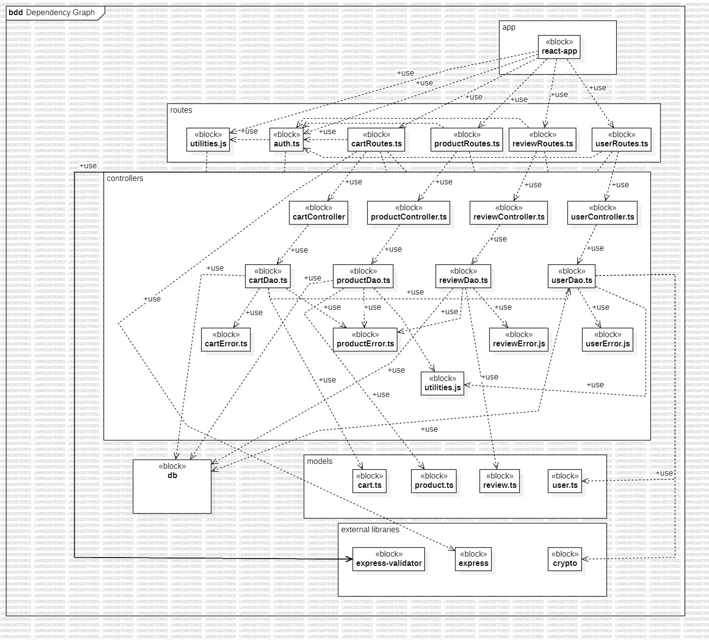
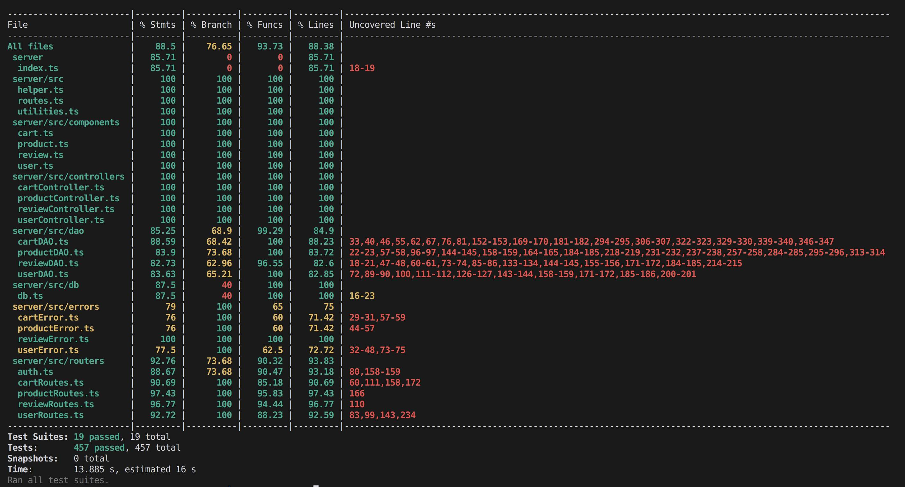

# Test Report

<The goal of this document is to explain how the application was tested, detailing how the test cases were defined and what they cover>

# Contents

- [Test Report](#test-report)
- [Contents](#contents)
- [Dependency graph](#dependency-graph)
- [Integration approach](#integration-approach)
- [Tests](#tests)
- [Coverage](#coverage)
  - [Coverage of FR](#coverage-of-fr)
  - [Coverage white box](#coverage-white-box)

# Dependency graph

# Integration approach

The integration testing for the EzElectronics application was conducted using a mixed approach, combining both top-down and bottom-up strategies to ensure comprehensive coverage and interaction testing between modules. The sequence of integration was as follows:

- **Step 1: Unit Testing**  
  Individual units were tested in isolation to ensure that each component functioned correctly as a standalone unit. 

- **Step 2: Subsystem Integration (Bottom-Up)**  
  Integration began with the lower-level modules:
  - **Example** Integration of `UserDAO` with `UserController`.

- **Step 3: API Integration Testing**  
  The final step involved integrating and testing the API endpoints (`route.js`):
  - Testing all RESTful endpoints (`GET`, `POST`, `PATCH`, `DELETE`) for user and product management to ensure they interact correctly with the backend controllers and database.
  - Special focus was on security and error handling to ensure that the API responds correctly under various scenarios, such as unauthorized access or resource not found.

This mixed integration approach helped in identifying interface defects and ensuring that the components work together seamlessly as a whole system.

# Tests

<in the table below list the test cases defined For each test report the object tested, the test level (API, integration, unit) and the technique used to define the test case (BB/ eq partitioning, BB/ boundary, WB/ statement coverage, etc)> <split the table if needed>

# Unit Tests
| Test case name                                           | Object(s) tested                | Test level | Technique used              |
|----------------------------------------------------------|---------------------------------|------------|-----------------------------|
| It should return true                                    | UserController.createUser       | Unit       | WB/ statement coverage      |
| It should retrieve all users                             | UserController.getUsers         | Unit       | WB/ statement coverage      |
| should allow Admin to retrieve any user                  | UserController.getUserByUsername| Unit       | WB/ statement coverage      |
| should allow non-Admin to retrieve only their own info   | UserController.getUserByUsername| Unit       | WB/ statement coverage      |
| should throw UnauthorizedUserError for non-Admin access and return 401  | UserController.getUserByUsername| Unit       | WB/ statement coverage      |
| should throw UserNotFoundError if user does not exist **   | UserController.getUserByUsername| Unit       | WB/ statement coverage      |
| should allow a user to delete their own account          | UserController.deleteUser       | Unit       | WB/ statement coverage      |
| should allow Admin to delete a non-Admin user            | UserController.deleteUser       | Unit       | WB/ statement coverage      |
| should return 401 if non-Admin deletes  | UserController.deleteUser       | Unit       | WB/ statement coverage      |
| should return 401 if Admin deletes Admin| UserController.deleteUser       | Unit       | WB/ statement coverage      |
| should delete all non-Admin users                        | UserController.deleteAll        | Unit       | WB/ statement coverage      |
| should allow Admin to update any user's information      | UserController.updateUserInfo   | Unit       | WB/ statement coverage      |
| should return 400 if user selects future date as birthday| UserController.updateUserInfo   | Unit       | WB/ statement coverage      |
| should allow user to update their own information        | UserController.updateUserInfo   | Unit       | WB/ statement coverage      |
| should return 401 for non-Admin updates another user     | UserController.updateUserInfo   | Unit       | WB/ statement coverage      |
| should return users for a valid role                     | UserController.getUsersByRole   | Unit       | WB/ statement coverage      |
| should return 422 bad request for an invalid role        | UserController.getUsersByRole   | Unit       | WB/ statement coverage      |
| It should resolve true                                   | UserDAO.createUser              | Unit       | WB/ statement coverage      |
| It should return 409 if user already exists              | UserDAO.createUser              | Unit       | WB/ statement coverage      |
| should resolve with user data if user exists             | UserDAO.getUserByUsername       | Unit       | WB/ statement coverage      |
| should return 404 if user does not exist                 | UserDAO.getUserByUsername    | Unit       | WB/ statement coverage      |
| should resolve with all user data if users exist         | UserDAO.getAllUsers             | Unit       | WB/ statement coverage      |
| should resolve with an empty array if no users exist     | UserDAO.getAllUsers             | Unit       | WB/ statement coverage      |
| should resolve with all user data if users with specific role exist | UserDAO.getUsersByRole  | Unit       | WB/ statement coverage      |
| should resolve with an empty array if no users with the specified role exist | UserDAO.getUsersByRole | Unit | WB/ statement coverage  |
| should resolve true if user is successfully deleted      | UserDAO.deleteUser              | Unit       | WB/ statement coverage      |
| should reject with 404 if user does not exist | UserDAO.deleteUser           | Unit       | WB/ statement coverage      |
| should reject with 401 if user is an admin               | UserDAO.deleteUser              | Unit       | WB/ statement coverage      |
| should resolve true if all non-admin users are successfully deleted | UserDAO.deleteAllNonAdminUsers | Unit | WB/ statement coverage  |
| should resolve with updated user data if update is successful | UserDAO.updateUserInfo      | Unit       | WB/ statement coverage      |
| should reject with 404 if user does not exist | UserDAO.updateUserInfo       | Unit       | WB/ statement coverage      |
| should reject with 400 if birthdate is invalid (future date) | UserDAO.updateUserInfo   | Unit       | WB/ statement coverage      |
| It should return a 200 success code                      | POST /ezelectronics/users       | API        | WB/ statement coverage      |
| should return all users with a 200 status code for admin users | GET /ezelectronics/users     | API        | WB/ statement coverage      |
| should return 401 unauthorized for non-admin users       | GET /ezelectronics/users        | API        | WB/ statement coverage      |
| should return all specific role users with a 200 status code | GET /ezelectronics/users/roles/:role | API | WB/ statement coverage  |
| should return 422 bad request for an invalid role        | GET /ezelectronics/users/roles/:role | API | WB/ statement coverage  |
| should return 401 unauthorized for non-admin role access | GET /ezelectronics/users/roles/:role | API | WB/ statement coverage  |
| Admin retrieving any user's data                         | GET /ezelectronics/users/:username | API | WB/ statement coverage  |
| Non-admin trying to retrieve another user's data         | GET /ezelectronics/users/:username | API | WB/ statement coverage  |
| User retrieving their own data                           | GET /ezelectronics/users/:username | API | WB/ statement coverage  |
| Retrieving a non-existent user                           | GET /ezelectronics/users/:username | API | WB/ statement coverage  |
| Admin deleting a non-admin user                          | DELETE /ezelectronics/users/:username | API | WB/ statement coverage  |
| Admin attempting to delete another admin                 | DELETE /ezelectronics/users/:username | API | WB/ statement coverage  |
| Non-admin deleting their own account                     | DELETE /ezelectronics/users/:username | API | WB/ statement coverage  |
| Non-admin attempting to delete another user's account    | DELETE /ezelectronics/users/:username | API | WB/ statement coverage  |
| Deleting a non-existent user                             | DELETE /ezelectronics/users/:username | API | WB/ statement coverage  |
| Admin successfully deletes all non-Admin users           | DELETE /ezelectronics/users           | API | WB/ statement coverage  |
| Non-admin user attempting to delete all users            | DELETE /ezelectronics/users           | API | WB/ statement coverage  |
| Admin updating any user's information                    | PATCH /ezelectronics/users/:username  | API | WB/ statement coverage  |
| User updating their own information                      | PATCH /ezelectronics/users/:username  | API | WB/ statement coverage  |
| User attempting to update another user's information     | PATCH /ezelectronics/users/:username  | API | WB/ statement coverage  |
| Updating with invalid data (future birthdate)            | PATCH /ezelectronics/users/:username  | API | WB/ statement coverage  |
| Attempting to update a non-existent user                 | PATCH /ezelectronics/users/:username  | API | WB/ statement coverage  |
| should successfully register a new product               | ProductController.registerProducts | Unit     | WB/ statement coverage      |
| should return 422 for invalid category                   | ProductController.registerProducts | Unit     | WB/ statement coverage      |
| should return 400 for future arrival date                | ProductController.registerProducts | Unit     | WB/ statement coverage      |
| should successfully update product quantity              | ProductController.changeProductQuantity | Unit | WB/ statement coverage  |
| should return 400 for future date                        | ProductController.changeProductQuantity | Unit | WB/ statement coverage  |
| should mark the product as sold                          | ProductController.sellProduct | Unit | WB/ statement coverage  |
| should return 400 for invalid date                       | ProductController.sellProduct | Unit | WB/ statement coverage  |
| should successfully delete a product by model            | ProductController.deleteProduct | Unit       | WB/ statement coverage      |
| should successfully delete all products                  | ProductController.deleteAllProducts | Unit   | WB/ statement coverage      |
| should return all available products                     | ProductDAO.getAvailableProducts | Unit       | WB/ statement coverage      |
| should reject with 422 if category is null when grouping by category | ProductDAO.getAvailableProducts | Unit       | WB/ statement coverage      |
| should reject with 422 if model is not null when grouping by category | ProductDAO.getAvailableProducts | Unit       | WB/ statement coverage      |
| should reject with 422 if model is null when grouping by model | ProductDAO.getAvailableProducts | Unit       | WB/ statement coverage      |
| should reject with 422 if category is not null when grouping by model | ProductDAO.getAvailableProducts | Unit       | WB/ statement coverage      |
| should reject with 422 if category and model are not null when grouping is null | ProductDAO.getAvailableProducts | Unit       | WB/ statement coverage      |
| should reject with ProductNotFoundError if model does not exist | ProductDAO.getAvailableProducts | Unit       | WB/ statement coverage      |
| should successfully register a new product               | ProductDAO.registerProducts     | Unit       | WB/ statement coverage      |
| should reject with DateError if arrival date is in the future | ProductDAO.registerProducts | Unit       | WB/ statement coverage      |
| should reject with ProductAlreadyExistsError if model already exists | ProductDAO.registerProducts | Unit       | WB/ statement coverage      |
| should reject with a database error during model check   | ProductDAO.registerProducts     | Unit       | WB/ statement coverage      |
| should reject with a database error during product insertion | ProductDAO.registerProducts | Unit       | WB/ statement coverage      |
| should successfully increase product quantity            | ProductDAO.changeProductQuantity| Unit       | WB/ statement coverage      |
| should return 404 if model does not exist | ProductDAO.changeProductQuantity | Unit       | WB/ statement coverage      |
| should return 400 if change date is before product arrival date | ProductDAO.changeProductQuantity | Unit       | WB/ statement coverage      |
| should reject with a database error during quantity check | ProductDAO.changeProductQuantity | Unit       | WB/ statement coverage      |
| should reject with a database error during quantity update | ProductDAO.changeProductQuantity | Unit       | WB/ statement coverage      |
| should return all available products                     | ProductDAO.getAvailableProducts | Unit       | WB/ statement coverage      |
| should reject with 422 if category is null when grouping by category | ProductDAO.getAvailableProducts | Unit       | WB/ statement coverage      |
| should reject with 422 if model is not null when grouping by category | ProductDAO.getAvailableProducts | Unit       | WB/ statement coverage      |
| should reject with 422 if model is null when grouping by model | ProductDAO.getAvailableProducts | Unit       | WB/ statement coverage      |
| should reject with 422 if category is not null when grouping by model | ProductDAO.getAvailableProducts | Unit       | WB/ statement coverage      |
| should reject with 422 if category and model are not null when grouping is null | ProductDAO.getAvailableProducts | Unit       | WB/ statement coverage      |
| should reject with ProductNotFoundError if model does not exist when grouping by model | ProductDAO.getAvailableProducts | Unit       | WB/ statement coverage      |
| should successfully delete a product                     | ProductDAO.deleteProduct        | Unit       | WB/ statement coverage      |
| should return 404 if model does not exist | ProductDAO.deleteProduct        | Unit       | WB/ statement coverage      |
| should reject with a database error during product check | ProductDAO.deleteProduct        | Unit       | WB/ statement coverage      |
| should reject with a database error during product deletion | ProductDAO.deleteProduct       | Unit       | WB/ statement coverage      |
| should resolve to true if all products are successfully deleted | ProductDAO.deleteAllProducts    | Unit       | WB/ statement coverage  |
| should reject with a database error during product deletion | ProductDAO.deleteAllProducts       | Unit       | WB/ statement coverage      |
| Successful product registration by an authorized user    | POST /ezelectronics/products    | API        | WB/ statement coverage      |
| Attempt to register a product with an existing model     | POST /ezelectronics/products    | API        | WB/ statement coverage      |
| Attempt to register a product with invalid category      | POST /ezelectronics/products    | API        | WB/ statement coverage      |
| Attempt to register a product with invalid date          | POST /ezelectronics/products    | API        | WB/ statement coverage      |
| Attempt to retrieve available products with invalid category | GET /ezelectronics/products/available | API | WB/ statement coverage  |
| Attempt to retrieve available products with invalid model | GET /ezelectronics/products/available | API | WB/ statement coverage  |
| Unauthorized user attempting to retrieve available products | GET /ezelectronics/products/available | API | WB/ statement coverage  |
| Invalid query parameter combinations                     | GET /ezelectronics/products/available | API | WB/ statement coverage  |
| Successful deletion of all products by an authorized user | DELETE /ezelectronics/products | API       | WB/ statement coverage      |
| Unauthorized user attempting to delete all products      | DELETE /ezelectronics/products | API       | WB/ statement coverage      |
| should successfully add a new product to a new cart      | CartController.addToCart        | Unit       | WB/ statement coverage      |
| should retrieve the current cart for a user              | CartController.getCart          | Unit       | WB/ statement coverage      |
| should successfully checkout a user's cart               | CartController.checkoutCart     | Unit       | WB/ statement coverage      |
| should successfully clear all products from the user's cart | CartController.clearCart      | Unit       | WB/ statement coverage      |
| should successfully bring user's cart | CartController.getCustomerCarts      | Unit       | WB/ statement coverage      |
| should successfully remove a product from the cart | CartController.removeProductFromCart      | Unit       | WB/ statement coverage      |
| should successfully clear all products from the user's cart | CartController.deleteAllCarts      | Unit       | WB/ statement coverage      |
| should successfully bring all carts in the system | CartController.getAllCarts| Unit       | WB/ statement coverage      |
| should successfully add a product to the cart            | CartDAO.addToCart               | Unit       | WB/ statement coverage      |
| should return 404 if the product does not exist              | CartDAO.addToCart               | Unit       | WB/ statement coverage      |
| should return 409 if the product is out of stock             | CartDAO.addToCart               | Unit       | WB/ statement coverage      |
| should reject with a database error during product retrieval | CartDAO.addToCart            | Unit       | WB/ statement coverage      |
| should create a new cart if one does not exist           | CartDAO.addToCart               | Unit       | WB/ statement coverage      |
| should add product to existing cart                      | CartDAO.addToCart               | Unit       | WB/ statement coverage      |
| should reject with a database error during cart creation  | CartDAO.addToCart               | Unit       | WB/ statement coverage      |
| should reject with a database error during cart item insertion | CartDAO.addToCart           | Unit       | WB/ statement coverage      |
| should update quantity if product already in cart        | CartDAO.addToCart               | Unit       | WB/ statement coverage      |
| should reject with a database error during cart update   | CartDAO.addToCart               | Unit       | WB/ statement coverage      |
| should successfully retrieve the user's cart             | CartDAO.getCart                 | Unit       | WB/ statement coverage      |
| should return an empty cart if no cart exists            | CartDAO.getCart                 | Unit       | WB/ statement coverage      |
| should reject with a database error during cart retrieval| CartDAO.getCart                 | Unit       | WB/ statement coverage      |
| should successfully retrieve products in the cart        | CartDAO.getCart                 | Unit       | WB/ statement coverage      |
| should reject with a database error during product retrieval in cart | CartDAO.getCart         | Unit       | WB/ statement coverage      |
| should successfully checkout the cart                    | CartDAO.checkoutCart            | Unit       | WB/ statement coverage      |
| should return 404 if no cart exists for the user             | CartDAO.checkoutCart            | Unit       | WB/ statement coverage      |
| should return 400 if cart is empty                           | CartDAO.checkoutCart            | Unit       | WB/ statement coverage      |
| should reject with a database error during cart retrieval| CartDAO.checkoutCart            | Unit       | WB/ statement coverage      |
| should return 409 if product stock is insufficient           | CartDAO.checkoutCart            | Unit       | WB/ statement coverage      |
| should reject with a database error during stock check   | CartDAO.checkoutCart            | Unit       | WB/ statement coverage      |
| should reject with a database error during cart update   | CartDAO.checkoutCart            | Unit       | WB/ statement coverage      |
| should successfully retrieve all carts                   | CartDAO.getAllCarts             | Unit       | WB/ statement coverage      |
| should handle empty result set and return empty array    | CartDAO.getAllCarts             | Unit       | WB/ statement coverage      |
| should reject with a database error during cart retrieval| CartDAO.getAllCarts             | Unit       | WB/ statement coverage      |
| should successfully retrieve all paid carts for a customer | CartDAO.getCustomerCarts       | Unit       | WB/ statement coverage      |
| should handle empty result set and return empty array    | CartDAO.getCustomerCarts       | Unit       | WB/ statement coverage      |
| should reject with a database error during cart retrieval| CartDAO.getCustomerCarts       | Unit       | WB/ statement coverage      |
| should successfully remove a product from the cart       | CartDAO.removeProductFromCart   | Unit       | WB/ statement coverage      |
| should return 404 if the product does not exist              | CartDAO.removeProductFromCart   | Unit       | WB/ statement coverage      |
| should return 404 if the cart does not exist                 | CartDAO.removeProductFromCart   | Unit       | WB/ statement coverage      |
| should return 404 if the product is not in the cart          | CartDAO.removeProductFromCart   | Unit       | WB/ statement coverage      |
| should reject with a database error during product check | CartDAO.removeProductFromCart   | Unit       | WB/ statement coverage      |
| should reject with a database error during cart check    | CartDAO.removeProductFromCart   | Unit       | WB/ statement coverage      |
| should reject with a database error during update        | CartDAO.removeProductFromCart   | Unit       | WB/ statement coverage      |
| should reject with a database error during deletion      | CartDAO.removeProductFromCart   | Unit       | WB/ statement coverage      |
| should successfully clear all products from the cart     | CartDAO.clearCart               | Unit       | WB/ statement coverage      |
| should return 404 if no cart exists for the user             | CartDAO.clearCart               | Unit       | WB/ statement coverage      |
| should reject with a database error during cart check    | CartDAO.clearCart               | Unit       | WB/ statement coverage      |
| should reject with a database error during product deletion | CartDAO.clearCart             | Unit       | WB/ statement coverage      |
| should reject with a database error during cart total update | CartDAO.clearCart            | Unit       | WB/ statement coverage      |
| should successfully delete all cart items and carts      | CartDAO.deleteAllCarts          | Unit       | WB/ statement coverage      |
| should reject with a database error during cart items deletion | CartDAO.deleteAllCarts      | Unit       | WB/ statement coverage      |
| should reject with a database error during carts deletion | CartDAO.deleteAllCarts         | Unit       | WB/ statement coverage      |
| should successfully add a review                         | ReviewController.addReview      | Unit       | WB/ statement coverage      |
| should successfully bring reviews of a product    | ReviewController.getProductReviews      | Unit       | WB/ statement coverage      |
| should successfully delete review from a product | ReviewController.deleteReview      | Unit       | WB/ statement coverage      |
| should successfully delete all reviews from a product | ReviewController.deleteAllReviews      | Unit | WB/ statement coverage  |
| should successfully add a review                         | ReviewDAO.addReview             | Unit       | WB/ statement coverage      |
| should return 404 if the user does not exist                 | ReviewDAO.addReview             | Unit       | WB/ statement coverage      |
| should return 404 if the product does not exist              | ReviewDAO.addReview             | Unit       | WB/ statement coverage      |
| should reject if the customer has not purchased the product | ReviewDAO.addReview          | Unit       | WB/ statement coverage      |
| should return 409 if the review already exists               | ReviewDAO.addReview             | Unit       | WB/ statement coverage      |
| should reject with a database error during user check    | ReviewDAO.addReview             | Unit       | WB/ statement coverage      |
| should reject with a database error during product check | ReviewDAO.addReview             | Unit       | WB/ statement coverage      |
| should reject with a database error during purchase check| ReviewDAO.addReview             | Unit       | WB/ statement coverage      |
| should reject with a database error during review check  | ReviewDAO.addReview             | Unit       | WB/ statement coverage      |
| should reject with a database error during review insertion | ReviewDAO.addReview           | Unit       | WB/ statement coverage      |
| should successfully retrieve all reviews for a product   | ReviewDAO.getProductReviews     | Unit       | WB/ statement coverage      |
| should return 404 if the product does not exist              | ReviewDAO.getProductReviews     | Unit       | WB/ statement coverage      |
| should reject with a database error during product check | ReviewDAO.getProductReviews     | Unit       | WB/ statement coverage      |
| should reject with a database error during review retrieval | ReviewDAO.getProductReviews   | Unit       | WB/ statement coverage      |
| should handle empty review set and return empty array    | ReviewDAO.getProductReviews     | Unit       | WB/ statement coverage      |
| should successfully delete a review                      | ReviewDAO.deleteReview          | Unit       | WB/ statement coverage      |
| should return 404 if the user does not exist                 | ReviewDAO.deleteReview          | Unit       | WB/ statement coverage      |
| should return 404 if the product does not exist              | ReviewDAO.deleteReview          | Unit       | WB/ statement coverage      |
| should reject if the customer has not purchased the product | ReviewDAO.deleteReview        | Unit       | WB/ statement coverage      |
| should return 404 if the review does not exist               | ReviewDAO.deleteReview          | Unit       | WB/ statement coverage      |
| should reject with a database error during user check    | ReviewDAO.deleteReview          | Unit       | WB/ statement coverage      |
| should reject with a database error during product check | ReviewDAO.deleteReview          | Unit       | WB/ statement coverage      |
| should reject with a database error during purchase check| ReviewDAO.deleteReview          | Unit       | WB/ statement coverage      |
| should reject with a database error during review check  | ReviewDAO.deleteReview          | Unit       | WB/ statement coverage      |
| should reject with a database error during review deletion | ReviewDAO.deleteReview        | Unit       | WB/ statement coverage      |
| should successfully delete all reviews for a product     | ReviewDAO.deleteReviewsOfProduct| Unit       | WB/ statement coverage      |
| should return 404 if the product does not exist              | ReviewDAO.deleteReviewsOfProduct| Unit       | WB/ statement coverage      |
| should return 404 if no reviews exist for the product        | ReviewDAO.deleteReviewsOfProduct| Unit       | WB/ statement coverage      |
| should reject with a database error during product check | ReviewDAO.deleteReviewsOfProduct| Unit       | WB/ statement coverage      |
| should reject with a database error during review existence check | ReviewDAO.deleteReviewsOfProduct | Unit | WB/ statement coverage  |
| should reject with a database error during review deletion | ReviewDAO.deleteReviewsOfProduct | Unit | WB/ statement coverage  |
| should successfully delete all reviews                   | ReviewDAO.deleteAllReviews      | Unit       | WB/ statement coverage      |
| should reject with a database error during review deletion | ReviewDAO.deleteAllReviews    | Unit       | WB/ statement coverage      |

# Integration Tests

| Test case name                                           | Object(s) tested                | Test level | Technique used              |
|----------------------------------------------------------|---------------------------------|------------|-----------------------------|
| It should successfully add a product to the cart by an authorized user | POST /carts                    | Integration| Black-box                   |
| It should return 403 for unauthorized user attempting to add a product to the cart | POST /carts                    | Integration| Black-box                   |
| It should return 404 when attempting to add a non-existent product model | POST /carts                    | Integration| Black-box                   |
| It should return 409 when attempting to add a product with zero available quantity | POST /carts                    | Integration| Black-box                   |
| It should return 422 when attempting to add a product with an empty model parameter | POST /carts                    | Integration| Black-box                   |
| It should retrieve the current cart for an authorized user with products | GET /carts                    | Integration| Black-box                   |
| It should retrieve an empty cart for an authorized user when no cart exists | GET /carts                    | Integration| Black-box                   |
| It should return 403 for unauthorized user attempting to retrieve a cart | GET /carts                    | Integration| Black-box                   |
| It should retrieve the history of paid carts for an authorized user | GET /carts/history            | Integration| Black-box                   |
| It should return 403 for unauthorized user attempting to retrieve cart history | GET /carts/history            | Integration| Black-box                   |
| It should handle no history available for the user (empty result) | GET /carts/history            | Integration| Black-box                   |
| It should successfully remove a product from the cart by an authorized user | DELETE /carts/products/:model  | Integration| Black-box                   |
| It should return 403 for unauthorized user attempting to remove a product from the cart | DELETE /carts/products/:model  | Integration| Black-box                   |
| It should return 404 when attempting to remove a product from a cart when no cart exists | DELETE /carts/products/:model  | Integration| Black-box                   |
| It should return 404 when attempting to remove a product that is not in the cart | DELETE /carts/products/:model  | Integration| Black-box                   |
| It should return 404 when attempting to remove a non-existent product model | DELETE /carts/products/:model  | Integration| Black-box                   |
| It should successfully clear the cart by an authorized user | DELETE /carts/current          | Integration| Black-box                   |
| It should return 403 for unauthorized user attempting to clear the cart | DELETE /carts/current          | Integration| Black-box                   |
| It should return 404 when attempting to clear the cart when no cart exists | DELETE /carts/current          | Integration| Black-box                   |
| It should successfully delete all carts by an authorized user | DELETE /carts                  | Integration| Black-box                   |
| It should return 403 for unauthorized user attempting to delete all carts | DELETE /carts                  | Integration| Black-box                   |
| It should successfully retrieve all carts by an authorized user | GET /carts/all                  | Integration| Black-box                   |
| It should return 403 for unauthorized user attempting to retrieve all carts | GET /carts/all                  | Integration| Black-box                   |
| It should return a 200 status code indicating success    | POST /products                  | Integration| Black-box                   | 
| It should return a 409 status code indicating conflict due to existing model | POST /products                  | Integration| Black-box |
| It should return a 422 status code indicating unprocessable entity due to invalid category | POST /products                  | Integration| Black-box                   
| It should return a 422 status code indicating unprocessable entity due to invalid quantity | POST /products                  | Integration| Black-box                   
| It should return a 422 status code indicating unprocessable entity due to invalid selling price |POST /products                  | Integration| Black-box                   
 | It should return a 400 status code indicating bad request due to future arrival date | POST /products                  | Integration| Black-box  | 
 | It should return a 403 status code indicating forbidden access for unauthorized users | POST /products                  | Integration| Black-box    |              
| Successful increase in product quantity by an authorized user, should return 200 with updated quantity | PATCH /products/:model          | Integration| Black-box                   |
| Attempt to increase quantity for a non-existent product model, should return 404 | PATCH /products/:model          | Integration| Black-box                   |
| Attempt to increase quantity with a future change date, should return 400 due to invalid date | PATCH /products/:model          | Integration| Black-box                   |
| Attempt to increase quantity with a change date before the product's arrival date, should return 400 due to invalid date | PATCH /products/:model          | Integration| Black-box                   |
| Unauthorized user attempting to increase product quantity, should return 403 indicating forbidden access | PATCH /products/:model          | Integration| Black-box                   |
| Successful sale of a product by an authorized user, should return 200 with updated quantity | PATCH /products/:model/sell     | Integration| Black-box                   |
| Attempt to sell a non-existent product model, should return 404 | PATCH /products/:model/sell     | Integration| Black-box                   |
| Attempt to sell with a future selling date, should return 400 due to invalid date | PATCH /products/:model/sell     | Integration| Black-box                   |
| Attempt to sell with a selling date before the product's arrival date, should return 400 due to invalid date | PATCH /products/:model/sell     | Integration| Black-box                   |
| Attempt to sell more units than are available in stock, should return 409 due to insufficient stock | PATCH /products/:model/sell     | Integration| Black-box                   |
| Unauthorized user attempting to sell a product, should return 403 indicating forbidden access | PATCH /products/:model/sell     | Integration| Black-box                   |
| Retrieve all products without any filters, should return 200 with an empty array | GET /products                   | Integration| Black-box                   |
| Retrieve products filtered by category, should return 200 with an empty array | GET /products                   | Integration| Black-box                   |
| Retrieve products filtered by model, should return 200 with an empty array | GET /products                   | Integration| Black-box                   |
| Attempt to retrieve products with invalid category, should return 422 due to invalid input | GET /products                   | Integration| Black-box                   |
| Attempt to retrieve products with invalid model, should return 404 as model does not exist | GET /products                   | Integration| Black-box                   |
| Unauthorized user attempting to retrieve products, should return 403 indicating forbidden access | GET /products                   | Integration| Black-box                   |
| Invalid query parameter combinations, should return 422 due to invalid input parameters | GET /products                   | Integration| Black-box                   |
| Retrieve all available products without any filters, should return 200 with an empty array | GET /products/available         | Integration| Black-box                   |
| Retrieve available products filtered by category, should return 200 with an empty array | GET /products/available         | Integration| Black-box                   |
| Retrieve available products filtered by model, should return 200 with an empty array | GET /products/available         | Integration| Black-box                   |
| Attempt to retrieve available products with invalid category, should return 422 due to invalid input | GET /products/available         | Integration| Black-box                   |
| Attempt to retrieve available products with invalid model, should return 404 as model does not exist | GET /products/available         | Integration| Black-box                   |
| Unauthorized user attempting to retrieve available products, should return 403 indicating forbidden access | GET /products/available         | Integration| Black-box                   |
| Invalid query parameter combinations, should return 422 due to invalid input parameters | GET /products/available         | Integration| Black-box                   |
| Successful deletion of all products by an authorized user, should return 200 | DELETE /products               | Integration| Black-box                   |
| Unauthorized user attempting to delete all products, should return 403 indicating forbidden access | DELETE /products               | Integration| Black-box                   |
| Successful addition of a review by an authorized user, should return 200 | POST /reviews/:model            | Integration| Black-box                   |
| Unauthorized user attempting to add a review, should return 403 indicating forbidden access | POST /reviews/:model            | Integration| Black-box                   |
| Attempt to add a review for a non-existent product, should return 404 as product does not exist | POST /reviews/:model            | Integration| Black-box                   |
| Attempt to add a review for a product not purchased by the user, should return 503 indicating service unavailable | POST /reviews/:model            | Integration| Black-box                   |
| Attempt to add a review when a review already exists, should return 409 indicating conflict | POST /reviews/:model            | Integration| Black-box                   |
| Validation errors for score and comment, should return 422 due to invalid input | POST /reviews/:model            | Integration| Black-box                   |
| Successful retrieval of all reviews for a product by an authenticated user, should return 200 with reviews | GET /reviews/:model             | Integration| Black-box                   |
| Unauthorized user attempting to retrieve reviews, should return 403 indicating forbidden access | GET /reviews/:model             | Integration| Black-box                   |
| Attempt to retrieve reviews for a non-existent product, should return 404 as product does not exist | GET /reviews/:model             | Integration| Black-box                   |
| Successful deletion of a review by an authorized user, should return 200 | DELETE /reviews/:model          | Integration| Black-box                   |
| Unauthorized user attempting to delete a review, should return 403 indicating forbidden access | DELETE /reviews/:model          | Integration| Black-box                   |
| Attempt to delete a review for a non-existent product, should return 404 as product does not exist | DELETE /reviews/:model          | Integration| Black-box                   |
| Attempt to delete a review that does not exist for the user, should return 404 indicating no review found | DELETE /reviews/:model          | Integration| Black-box                   |
| Successful deletion of all reviews for a product by an authorized user, should return 200 | DELETE /reviews/:model/all      | Integration| Black-box                   |
| Unauthorized user attempting to delete all reviews, should return 403 indicating forbidden access | DELETE /reviews/:model/all      | Integration| Black-box                   |
| Attempt to delete reviews for a non-existent product, should return 404 as product does not exist | DELETE /reviews/:model/all      | Integration| Black-box                   |
| Successful deletion of all reviews by an authorized user, should return 200 | DELETE /reviews                | Integration| Black-box                   |
| Unauthorized user attempting to delete all reviews, should return 403 indicating forbidden access | DELETE /reviews                | Integration| Black-box                   |
| Successful creation of a user with valid details, should return 200 | POST /users                     | Integration| Black-box                   |
| Retrieve all users with a 200 status code for admin users, should return 200 | GET /users                     | Integration| Black-box                   |
| Unauthorized access by a non-admin user, should return 401 | GET /users                     | Integration| Black-box                   |
| Retrieve all MANAGER users with a 200 status code, should return 200 | GET /users/roles/MANAGER        | Integration| Black-box                   |
| Retrieve all CUSTOMER users with a 200 status code, should return 200 | GET /users/roles/CUSTOMER       | Integration| Black-box                   |
| Retrieve all ADMIN users with a 200 status code, should return 200 | GET /users/roles/ADMIN          | Integration| Black-box                   |
| Return 422 bad request for an invalid role, should return 422 | GET /users/roles/NonExistentRole | Integration| Black-box                   |
| Unauthorized access by a non-admin user, should return 401 | GET /users/roles/MANAGER        | Integration| Black-box                   |
| Admin retrieving any user's data, should return 200      | GET /users/:username            | Integration| Black-box                   |
| Non-admin trying to retrieve another user's data, should return 401 | GET /users/:username            | Integration| Black-box                   |
| User retrieving their own data, should return 200        | GET /users/:username            | Integration| Black-box                   |
| Retrieving a non-existent user, should return 404        | GET /users/:username            | Integration| Black-box                   |
| Admin deleting a non-admin user, should return 200       | DELETE /users/:username         | Integration| Black-box                   |
| Admin attempting to delete another admin, should return 401 | DELETE /users/:username         | Integration| Black-box                   |
| Non-admin deleting their own account, should return 200  | DELETE /users/:username         | Integration| Black-box                   |
| Non-admin attempting to delete another user's account, should return 401 | DELETE /users/:username         | Integration| Black-box                   |
| Deleting a non-existent user, should return 404          | DELETE /users/:username         | Integration| Black-box                   |
| Admin successfully deletes all non-Admin users, should return 200 | DELETE /users                   | Integration| Black-box                   |
| Non-admin user attempting to delete all users, should return 403 | DELETE /users                   | Integration| Black-box                   |
| Admin updating any user's information, should return 200 | PATCH /users/:username          | Integration| Black-box                   |
| User updating their own information, should return 200   | PATCH /users/:username          | Integration| Black-box                   |
| User attempting to update another user's information, should return 401 | PATCH /users/:username          | Integration| Black-box                   |
| Updating with invalid data (future birthdate), should return 400 | PATCH /users/:username          | Integration| Black-box                   |
| Attempting to update a non-existent user, should return 404 | PATCH /users/:username          | Integration| Black-box                   |
| Return the current cart for a logged-in customer with products, should return 200 | GET /ezelectronics/carts        | Integration| Black-box                   |
| Return an empty cart for a logged-in customer with no unpaid cart, should return 200 | GET /ezelectronics/carts        | Integration| Black-box                   |
| Return 401 if the user is not logged in, should return 401 | GET /ezelectronics/carts        | Integration| Black-box                   |
| Return 401 if the logged-in user is not a customer, should return 401 | GET /ezelectronics/carts        | Integration| Black-box                   |
| Add a product to the current cart for a logged-in customer, should return 200 | POST /ezelectronics/carts       | Integration| Black-box                   |
| Increase the quantity of an existing product in the cart, should return 200 | POST /ezelectronics/carts       | Integration| Black-box                   |
| Return 404 if the product model does not exist, should return 404 | POST /ezelectronics/carts       | Integration| Black-box                   |
| Return 409 if the product quantity is 0, should return 409 | POST /ezelectronics/carts       | Integration| Black-box                   |
| Return 401 if the user is not logged in, should return 401 | POST /ezelectronics/carts       | Integration| Black-box                   |
| Return 401 if the logged-in user is not a customer, should return 401 | POST /ezelectronics/carts       | Integration| Black-box                   |
| Successfully simulate payment for the current cart, should return 200 | PATCH /ezelectronics/carts      | Integration| Black-box                   |
| Return 404 if there is no information about an unpaid cart, should return 404 | PATCH /ezelectronics/carts      | Integration| Black-box                   |
| Return 400 if the cart contains no product, should return 400 | PATCH /ezelectronics/carts      | Integration| Black-box                   |
| Return 409 if there is at least one product in the cart whose available quantity in the stock is 0, should return 409 | PATCH /ezelectronics/carts      | Integration| Black-box                   |
| Return 409 if there is at least one product in the cart whose quantity is higher than the available quantity in the stock, should return 409 | PATCH /ezelectronics/carts      | Integration| Black-box                   |
| Return 401 if the user is not logged in, should return 401 | PATCH /ezelectronics/carts      | Integration| Black-box                   |
| Return 401 if the logged-in user is not a customer, should return 401 | PATCH /ezelectronics/carts      | Integration| Black-box                   |
| Return the history of paid carts for a logged-in customer, should return 200 | GET /ezelectronics/carts/history | Integration| Black-box                   |
| Return an empty array if there is no history of paid carts for the customer, should return 200 | GET /ezelectronics/carts/history | Integration| Black-box                   |
| Return 401 if the user is not logged in, should return 401 | GET /ezelectronics/carts/history | Integration| Black-box                   |
| Return 401 if the logged-in user is not a customer, should return 401 | GET /ezelectronics/carts/history | Integration| Black-box                   |
| Remove a product from the current cart of a logged-in customer, should return 200 | DELETE /ezelectronics/carts/products/:model | Integration| Black-box                   |
| Return 404 if the product is not in the cart, should return 404 | DELETE /ezelectronics/carts/products/:model | Integration| Black-box                   |
| Return 404 if there is no information about an unpaid cart, should return 404 | DELETE /ezelectronics/carts/products/:model | Integration| Black-box                   |
| Return 404 if the product model does not exist, should return 404 | DELETE /ezelectronics/carts/products/:model | Integration| Black-box                   |
| Return 401 if the user is not logged in, should return 401 | DELETE /ezelectronics/carts/products/:model | Integration| Black-box                   |
| Return 401 if the logged-in user is not a customer, should return 401 | DELETE /ezelectronics/carts/products/:model | Integration| Black-box                   |
| Empty the current cart for a logged-in customer, should return 200 | DELETE /ezelectronics/carts/current | Integration| Black-box                   |
| Return 404 if there is no information about an unpaid cart, should return 404 | DELETE /ezelectronics/carts/current | Integration| Black-box                   |
| Return 401 if the user is not logged in, should return 401 | DELETE /ezelectronics/carts/current | Integration| Black-box                   |
| Return 401 if the logged-in user is not a customer, should return 401 | DELETE /ezelectronics/carts/current | Integration| Black-box                   |
| Empty the current cart for a logged-in customer, should return 200 | DELETE /ezelectronics/carts/current | Integration| Black-box                   |
| Return 404 if there is no information about an unpaid cart, should return 404 | DELETE /ezelectronics/carts/current | Integration| Black-box                   |
| Return 401 if the user is not logged in, should return 401 | DELETE /ezelectronics/carts/current | Integration| Black-box                   |
| Return 401 if the logged-in user is not a customer, should return 401 | DELETE /ezelectronics/carts/current | Integration| Black-box                   |
| Delete all existing carts when called by an admin, should return 200 | DELETE /ezelectronics/carts      | Integration| Black-box                   |
| Delete all existing carts when called by a manager, should return 200 | DELETE /ezelectronics/carts      | Integration| Black-box                   |
| Return 401 if the logged-in user is not an admin or manager, should return 401 | DELETE /ezelectronics/carts      | Integration| Black-box                   |
| Return 401 if the user is not logged in, should return 401 | DELETE /ezelectronics/carts      | Integration| Black-box                   |
| Return all carts for an admin, should return 200 | GET /ezelectronics/carts/all      | Integration| Black-box                   |
| Return all carts for a manager, should return 200 | GET /ezelectronics/carts/all      | Integration| Black-box                   |
| Return 401 if the logged-in user is not an admin or manager, should return 401 | GET /ezelectronics/carts/all      | Integration| Black-box                   |
| Return 401 if the user is not logged in, should return 401 | GET /ezelectronics/carts/all      | Integration| Black-box                   |
| Delete all products when called by an admin, should return 200 | DELETE /ezelectronics/products      | Integration| Black-box                   |
| Delete all products when called by a manager, should return 200 | DELETE /ezelectronics/products      | Integration| Black-box                   |
| Return 401 if the logged-in user is not an admin or manager, should return 401 | DELETE /ezelectronics/products      | Integration| Black-box                   |
| Return 401 if the user is not logged in, should return 401 | DELETE /ezelectronics/products      | Integration| Black-box                   |
| Allow admin to register a new product, should return 200 | POST /ezelectronics/products    | Integration| Black-box                   |
| Allow manager to register a new product, should return 200 | POST /ezelectronics/products    | Integration| Black-box                   |
| Return 401 if not logged in, should return 401 | POST /ezelectronics/products    | Integration| Black-box                   |
| Return 401 if logged in but not as admin or manager, should return 401 | POST /ezelectronics/products    | Integration| Black-box                   |
| Return 409 if model already exists, should return 409 | POST /ezelectronics/products    | Integration| Black-box                   |
| Return 400 if arrivalDate is in the future, should return 400 | POST /ezelectronics/products    | Integration| Black-box                   |
| Increase the quantity of an existing product by an authorized user, should return 200 | PATCH /ezelectronics/products/:model | Integration| Black-box                   |
| Return 404 if product model does not exist, should return 404 | PATCH /ezelectronics/products/:model | Integration| Black-box                   |
| Return 400 if changeDate is in the future, should return 400 | PATCH /ezelectronics/products/:model | Integration| Black-box                   |
| Return 400 if changeDate is before the product's arrivalDate, should return 400 | PATCH /ezelectronics/products/:model | Integration| Black-box                   |
| Return 401 if user is not authorized, should return 401 | PATCH /ezelectronics/products/:model | Integration| Black-box                   |
| Record a sale and reduce the quantity of an existing product by an authorized user, should return 200 | PATCH /ezelectronics/products/:model/sell | Integration| Black-box                   |
| Return 404 if product model does not exist, should return 404 | PATCH /ezelectronics/products/:model/sell | Integration| Black-box                   |
| Return 400 if sellingDate is in the future, should return 400 | PATCH /ezelectronics/products/:model/sell | Integration| Black-box                   |
| Return 400 if sellingDate is before the product's arrivalDate, should return 400 | PATCH /ezelectronics/products/:model/sell | Integration| Black-box                   |
| Return 409 if product quantity is 0, should return 409 | PATCH /ezelectronics/products/:model/sell | Integration| Black-box                   |
| Return 409 if selling quantity is greater than available quantity, should return 409 | PATCH /ezelectronics/products/:model/sell | Integration| Black-box                   |
| Return 401 if user is not authorized, should return 401 | PATCH /ezelectronics/products/:model/sell | Integration| Black-box                   |
| Return all products if no filters are applied, should return 200 | GET /ezelectronics/products    | Integration| Black-box                   |
| Return products filtered by category, should return 200 | GET /ezelectronics/products    | Integration| Black-box                   |
| Return product filtered by model, should return 200 | GET /ezelectronics/products    | Integration| Black-box                   |
| Return 422 if grouping is null and category or model is not null, should return 422 | GET /ezelectronics/products    | Integration| Black-box                   |
| Return 422 if grouping is category and category is null or model is not null, should return 422 | GET /ezelectronics/products    | Integration| Black-box                   |
| Return 422 if grouping is model and model is null or category is not null, should return 422 | GET /ezelectronics/products    | Integration| Black-box                   |
| Return 404 if model does not exist in the database, should return 404 | GET /ezelectronics/products    | Integration| Black-box                   |
| Return 401 if user is not authorized, should return 401 | GET /ezelectronics/products    | Integration| Black-box                   |
| Return all available products if no filters are applied, should return 200 | GET /ezelectronics/products/available | Integration| Black-box                   |
| Return available products filtered by category, should return 200 | GET /ezelectronics/products/available | Integration| Black-box                   |
| Return available product filtered by model, should return 200 | GET /ezelectronics/products/available | Integration| Black-box                   |
| Return 422 if grouping is null and category or model is not null, should return 422 | GET /ezelectronics/products/available | Integration| Black-box                   |
| Return 422 if grouping is category and category is null or model is not null, should return 422 | GET /ezelectronics/products/available | Integration| Black-box                   |
| Return 422 if grouping is model and model is null or category is not null, should return 422 | GET /ezelectronics/products/available | Integration| Black-box                   |
| Return 404 if model does not exist in the database, should return 404 | GET /ezelectronics/products/available | Integration| Black-box                   |
| Return 401 if user is not logged in, should return 401 | GET /ezelectronics/products/available | Integration| Black-box                   |
| Delete a product by an authorized user, should return 200 | DELETE /ezelectronics/products/:model | Integration| Black-box                   |
| Return 404 if product model does not exist, should return 404 | DELETE /ezelectronics/products/:model | Integration| Black-box                   |
| Return 401 if user is not authorized, should return 401 | DELETE /ezelectronics/products/:model | Integration| Black-box                   |
| Delete all products by an authorized user, should return 200 | DELETE /ezelectronics/products | Integration| Black-box                   |
| Return 401 if user is not authorized, should return 401 | DELETE /ezelectronics/products | Integration| Black-box                   |
| Add a new review for a product by a logged-in customer, should return 200 | POST /ezelectronics/reviews/:model | Integration| Black-box                   |
| Return 404 if the product model does not exist, should return 404 | POST /ezelectronics/reviews/:model | Integration| Black-box                   |
| Return 409 if there is an existing review for the product made by the customer, should return 409 | POST /ezelectronics/reviews/:model | Integration| Black-box                   |
| Return 401 if the user is not logged in, should return 401 | POST /ezelectronics/reviews/:model | Integration| Black-box                   |
| Return 401 if the logged-in user is not a customer, should return 401 | POST /ezelectronics/reviews/:model | Integration| Black-box                   |
| Delete the review made by the current user for a specific product, should return 200 | DELETE /ezelectronics/reviews/:model | Integration| Black-box                   |
| Return 404 if the product model does not exist, should return 404 | DELETE /ezelectronics/reviews/:model | Integration| Black-box                   |
| Return 404 if the current user does not have a review for the product, should return 404 | DELETE /ezelectronics/reviews/:model | Integration| Black-box                   |
| Return 401 if the user is not logged in, should return 401 | DELETE /ezelectronics/reviews/:model | Integration| Black-box                   |
| Return 401 if the logged-in user is not a customer, should return 401 | DELETE /ezelectronics/reviews/:model | Integration| Black-box                   |
| Delete all reviews for a specific product when called by an admin, should return 200 | DELETE /ezelectronics/reviews/:model/all | Integration| Black-box                   |
| Delete all reviews for a specific product when called by a manager, should return 200 | DELETE /ezelectronics/reviews/:model/all | Integration| Black-box                   |
| Return 404 if the product model does not exist, should return 404 | DELETE /ezelectronics/reviews/:model/all | Integration| Black-box                   |
| Return 401 if the logged-in user is not an admin or manager, should return 401 | DELETE /ezelectronics/reviews/:model/all | Integration| Black-box                   |
| Return 401 if the user is not logged in, should return 401 | DELETE /ezelectronics/reviews/:model/all | Integration| Black-box                   |
| Delete all reviews when called by an admin, should return 200 | DELETE /ezelectronics/reviews | Integration| Black-box                   |
| Delete all reviews when called by a manager, should return 200 | DELETE /ezelectronics/reviews | Integration| Black-box                   |
| Return 401 if the logged-in user is not an admin or manager, should return 401 | DELETE /ezelectronics/reviews | Integration| Black-box                   |
| Return 401 if the user is not logged in, should return 401 | DELETE /ezelectronics/reviews | Integration| Black-box                   |
| Retrieve all users if logged in as admin, should return 200 | GET /ezelectronics/users | Integration| Black-box                   |
| Return 401 if not logged in, should return 401 | GET /ezelectronics/users | Integration| Black-box                   |
| Return 401 if logged in but not as admin, should return 401 | GET /ezelectronics/users | Integration| Black-box                   |
| Retrieve all users with a specific role if logged in as admin, should return 200 | GET /ezelectronics/users/roles/:role | Integration| Black-box                   |
| Return 401 if not logged in, should return 401 | GET /ezelectronics/users/roles/:role | Integration| Black-box                   |
| Return 401 if logged in but not as admin, should return 401 | GET /ezelectronics/users/roles/:role | Integration| Black-box                   |
| Allow admin to retrieve any user, should return 200 | GET /ezelectronics/users/:username | Integration| Black-box                   |
| Allow user to retrieve their own information, should return 200 | GET /ezelectronics/users/:username | Integration| Black-box                   |
| Return 401 if user tries to access another user's information, should return 401 | GET /ezelectronics/users/:username | Integration| Black-box                   |
| Return 404 if user does not exist, should return 404 | GET /ezelectronics/users/:username | Integration| Black-box                   |
| Allow admin to delete a non-admin user, should return 200 | DELETE /ezelectronics/users/:username | Integration| Black-box                   |
| Allow user to delete their own account, should return 200 | DELETE /ezelectronics/users/:username | Integration| Black-box                   |
| Return 401 if user tries to delete another user's account, should return 401 | DELETE /ezelectronics/users/:username | Integration| Black-box                   |
| Return 401 if admin tries to delete another admin, should return 401 | DELETE /ezelectronics/users/:username | Integration| Black-box                   |
| Return 404 if user does not exist, should return 404 | DELETE /ezelectronics/users/:username | Integration| Black-box                   |
| Delete all non-Admin users if logged in as admin, should return 200 | DELETE /ezelectronics/users | Integration| Black-box                   |
| Return 401 if not logged in, should return 401 | DELETE /ezelectronics/users | Integration| Black-box                   |
| Return 401 if logged in but not as admin, should return 401 | DELETE /ezelectronics/users | Integration| Black-box                   |
| Allow admin to update any non-admin user's information, should return 200 | PATCH /ezelectronics/users/:username | Integration| Black-box                   |
| Allow user to update their own information, should return 200 | PATCH /ezelectronics/users/:username | Integration| Black-box                   |
| Return 401 if user tries to update another user's information, should return 401 | PATCH /ezelectronics/users/:username | Integration| Black-box                   |
| Return 404 if user does not exist, should return 404 | PATCH /ezelectronics/users/:username | Integration| Black-box                   |
| Return 400 if birthdate is in the future, should return 400 | PATCH /ezelectronics/users/:username | Integration| Black-box                   |

# Coverage

## Coverage of FR

<Report in the following table the coverage of functional requirements and scenarios(from official requirements) >

| Functional Requirement or scenario              | Test(s)                                                                                   |
|:-----------------------------------------------:|:-----------------------------------------------------------------------------------------:|
| FR1.1: User Login                               | Success: 200 OK, Error: 401 Unauthorized (wrong credentials), 404 Not Found (user not found) |
| FR1.2: User Logout                              | Success: 200 OK, Error: 401 Unauthorized (not logged in)                                  |
| FR1.3: Create a new user account                | Success: 201 Created, Error: 400 Bad Request (invalid input), 409 Conflict (user exists)  |
| FR2.1: Show the list of all users               | Success: 200 OK, Error: 401 Unauthorized (not admin)                                      |
| FR2.2: Show the list of all users with a specific role | Success: 200 OK, Error: 401 Unauthorized (not admin), 404 Not Found (role not found) |
| FR2.3: Show the information of a single user    | Success: 200 OK, Error: 401 Unauthorized (not self or admin), 404 Not Found (user not found) |
| FR2.4: Update the information of a single user  | Success: 200 OK, Error: 400 Bad Request (invalid data), 401 Unauthorized (not self or admin), 404 Not Found (user not found) |
| FR2.5: Delete a single non-Admin user           | Success: 200 OK, Error: 401 Unauthorized (not admin), 404 Not Found (user not found)     |
| FR2.6: Delete all non-Admin users               | Success: 200 OK, Error: 401 Unauthorized (not admin)                                      |
| FR3.1: Register a set of new products           | Success: 201 Created, Error: 400 Bad Request (invalid input), 409 Conflict (product exists) |
| FR3.2: Update the quantity of a product         | Success: 200 OK, Error: 400 Bad Request (invalid date), 404 Not Found (product not found) |
| FR3.3: Sell a product                           | Success: 200 OK, Error: 400 Bad Request (invalid Date), 404 Not Found (product not found), 409 Conflict (insufficient stock) |
| FR3.4: Show the list of all products            | Success: 200 OK, Error: 401 Unauthorized (not logged in)                                  |
| FR3.4.1: Show the list of all available products| Success: 200 OK, Error: 401 Unauthorized (not logged in)                                  |
| FR3.5: Delete a product                         | Success: 200 OK, Error: 401 Unauthorized (not admin or manager), 404 Not Found (product not found) |
| FR3.6: Delete all products                      | Success: 200 OK, Error: 401 Unauthorized (not admin or manager)                           |
| FR3.7: View all products of a specific category | Success: 200 OK, Error: 404 Not Found (category not found)                                |
| FR4.1: Add a new review to a product            | Success: 201 Created, Error: 400 Bad Request (invalid input), 401 Unauthorized (not customer), 404 Not Found (user or product not found), 409 Conflict (review exists) |
| FR4.2: Get the list of all reviews for a product| Success: 200 OK, Error: 404 Not Found (product not found)                                 |
| FR4.3: Delete a review given to a product       | Success: 200 OK, Error: 401 Unauthorized (not author or admin), 404 Not Found (review or user not found) |
| FR4.4: Delete all reviews of a product          | Success: 200 OK, Error: 401 Unauthorized (not admin), 404 Not Found (review or product not found)   |
| FR4.5: Delete all reviews of all products       | Success: 200 OK, Error: 401 Unauthorized (not admin)                                      |
| FR5.1: Show the information of the current cart | Success: 200 OK, Error: 401 Unauthorized (not customer), 404 Not Found (cart not found)   |
| FR5.2: Add a product to the current cart        | Success: 200 OK, Error:, 401 Unauthorized (not customer), 404 Not Found (product not found), 409 Conflict (insufficient stock) |
| FR5.3: Checkout the current cart                | Success: 200 OK, Error: 400 Bad Request (empty cart), 401 Unauthorized (not customer) |
| FR5.4: Show the history of the paid carts       | Success: 200 OK, Error: 401 Unauthorized (not customer)                                   |
| FR5.5: Remove a product from the current cart   | Success: 200 OK, Error: 401 Unauthorized (not customer), 404 Not Found (product not in cart or product does not exist or cart does not exist) |
| FR5.6: Delete the current cart                  | Success: 200 OK, Error: 401 Unauthorized (not customer), 404 Not Found (cart not found)    |
| FR5.7: See the list of all carts of all users   | Success: 200 OK, Error: 401 Unauthorized (not admin)                                      |
| FR5.8: Delete all carts                         | Success: 200 OK, Error: 401 Unauthorized (not admin)                                      |

This table ensures that each functional requirement is adequately tested through specific test cases, providing a clear traceability from requirements to tests.

## Coverage white box

Report here the screenshot of coverage values obtained with jest-- coverage
